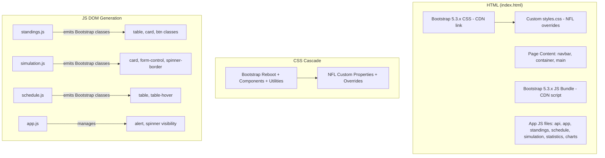

# Design Document: Bootstrap Frontend Migration

## Overview

This design describes the migration of the NFL Monte Carlo Playoff Ranking Simulator frontend from a custom 500-line CSS design system to Bootstrap 5.3.x. The migration replaces custom reset, grid, component, and utility styles with Bootstrap equivalents while preserving the NFL-branded visual identity through a minimal custom override stylesheet.

**Key design decisions:**
- Bootstrap loaded via CDN (no build tooling, no npm/webpack needed)
- Custom stylesheet reduced from ~500 lines to ≤200 lines of NFL-specific overrides
- All 7 JS files updated to emit Bootstrap class names in their DOM generation code
- Navigation, tables, forms, cards, spinners, and alerts converted to Bootstrap components
- Responsive range remains 1024px–1920px (no mobile-first redesign)

## Architecture

The architecture remains a static HTML/CSS/JS frontend served by a Flask backend. No structural changes to the file layout or module loading approach.



**Load order in index.html:**
1. `<link>` — Bootstrap 5.3.x CSS (CDN)
2. `<link>` — `css/styles.css` (NFL overrides, cascade wins)
3. Page content (navbar → container → main → footer)
4. `<script>` — Bootstrap 5.3.x JS bundle (CDN)
5. `<script>` — api.js, app.js, standings.js, schedule.js, simulation.js, statistics.js, charts.js

## Components and Interfaces

### 1. index.html — Structural Changes

**Navigation Bar:**
```html
<nav class="navbar navbar-expand-lg navbar-dark sticky-top" style="background-color:#1b3a6b">
  <div class="container-xl">
    <a class="navbar-brand d-flex align-items-center gap-2" href="#standings">
      
      <span>NFL Monte Carlo Playoff Ranking Simulator</span>
      <span id="app-version" class="text-muted small ms-2"></span>
    </a>
    <button class="navbar-toggler" type="button" data-bs-toggle="collapse"
            data-bs-target="#navbarNav" aria-controls="navbarNav"
            aria-expanded="false" aria-label="Toggle navigation">
      <span class="navbar-toggler-icon"></span>
    </button>
    <div class="collapse navbar-collapse" id="navbarNav">
      <ul class="navbar-nav ms-auto">
        <li class="nav-item"><a class="nav-link active" aria-current="page" href="#standings">Standings</a></li>
        <li class="nav-item"><a class="nav-link" href="#statistics">Statistics</a></li>
        <li class="nav-item"><a class="nav-link" href="#results">Results</a></li>
      </ul>
    </div>
  </div>
</nav>
<div class="header-disclaimer">...</div>
```

**Main content wrapper:**
```html
<div id="notification" class="container-xl mt-2 d-none" role="alert" aria-live="polite"></div>
<div id="loading" class="d-none" aria-label="Loading"></div>
<main id="content" class="container-xl py-4"></main>
```

**CDN references (pinned versions):**
- CSS: `https://cdn.jsdelivr.net/npm/bootstrap@5.3.3/dist/css/bootstrap.min.css`
- JS: `https://cdn.jsdelivr.net/npm/bootstrap@5.3.3/dist/js/bootstrap.bundle.min.js`

### 2. app.js — Notification System Changes

The notification system migrates from custom `.visible`/`.hidden` toggle classes to Bootstrap's alert component:

| Current approach | Bootstrap approach |
|---|---|
| Custom `.hidden`/`.visible` classes | Bootstrap `d-none` / `show` + `alert` classes |
| `notificationEl.textContent = message` | Render alert HTML with `alert-danger` or `alert-info` |
| Custom CSS animation | Bootstrap `fade show` + `alert-dismissible` |
| Manual timeout to hide | Same timeout, but also add `btn-close` for manual dismiss |

**Progress indicator migration:**
| Current | Bootstrap |
|---|---|
| Custom `.spinner` with CSS animation | `<div class="spinner-border text-primary" role="status"><span class="visually-hidden">Loading…</span></div>` |
| Custom `.progress-overlay` | Bootstrap positioning utilities: `position-fixed top-0 start-0 w-100 h-100` with backdrop opacity |

### 3. standings.js — Table and Card Changes

**Division section → Bootstrap card:**
```javascript
// Before
section.className = "division-section";
// After
section.className = "card mb-3";
```

**Division header → card-header:**
```javascript
// Before
header.className = "division-header";
// After
header.className = "card-header text-uppercase text-muted fw-semibold small";
```

**Standings table → Bootstrap table classes:**
```javascript
// Before
table.className = "standings-table";
// After
table.className = "table table-striped table-hover standings-table mb-0";
```

**Filter bar → Bootstrap button group with row/col:**
```javascript
// Before
bar.className = "filter-bar";
// After
bar.className = "card card-body mb-3 d-flex flex-row align-items-center gap-3";
```

**Controls panel → Bootstrap card:**
```javascript
// Before
panel.className = "controls-panel";
// After  
panel.className = "card card-body mb-3";
```

### 4. simulation.js — Form Controls and Feedback

**Form inputs:**
```javascript
// Number inputs get form-control
'<input type="number" id="sim-iterations" class="form-control" ...>'
// Range inputs get form-range
'<input type="range" id="sim-noise" class="form-range" ...>'
// Selects get form-select
'<select id="sim-cutoff-week" class="form-select" ...>'
```

**Buttons:**
```javascript
'<button id="btn-run-simulation" class="btn btn-primary" type="button">Run Simulation</button>'
'<button id="btn-fetch-data" class="btn btn-secondary" type="button">Fetch Data</button>'
```

**Progress indicator:**
```javascript
// Before
'<div class="spinner" aria-hidden="true"></div>'
// After
'<div class="spinner-border text-primary" role="status"><span class="visually-hidden">Running simulation…</span></div>'
```

### 5. schedule.js — Table Migration

```javascript
// Before
table.className = "schedule-table";
// After
table.className = "table table-hover schedule-table";
```

### 6. statistics.js — Card Wrapping

The statistics view already uses `controls-panel` which maps to `card card-body`. The probability table gets Bootstrap table classes.

### 7. css/styles.css — Reduced Custom Stylesheet

The new stylesheet contains only:
1. **CSS custom properties** — NFL brand colors, fonts, radii, shadows
2. **Navbar overrides** — disclaimer bar styling
3. **Conference-specific borders** — AFC red, NFC blue left borders
4. **Division leader highlighting** — background color + left border on first row
5. **Game result colors** — win/loss/tie text colors
6. **Team link styles** — hover/focus states
7. **Fixed column widths** — standings table column alignment
8. **Numeric cell styling** — right-aligned, tabular-nums, monospace
9. **Progress overlay** — custom backdrop opacity, centering
10. **Logo sizing** — contextual team logo dimensions
11. **Heatmap/chart container** — canvas sizing rules

## Data Models

No changes to data models. The API contracts remain identical. All changes are purely presentational — the JS modules continue to receive the same JSON structures and render them into DOM elements, just with different class names.

## Correctness Properties

*A property is a characteristic or behavior that should hold true across all valid executions of a system — essentially, a formal statement about what the system should do. Properties serve as the bridge between human-readable specifications and machine-verifiable correctness guarantees.*

### Property 1: Navigation active state synchronization

*For any* valid hash route that matches a navigation link's href, the corresponding `nav-link` element SHALL have the `active` class and `aria-current="page"` attribute, and all other nav-link elements SHALL NOT have the `active` class or `aria-current` attribute.

**Validates: Requirements 2.4**

### Property 2: Table Bootstrap class assignment

*For any* table rendered by the application (standings, results probability, schedule), the table element SHALL contain the Bootstrap `table` class plus the context-appropriate modifier classes (`table-striped table-hover` for standings and probability tables, `table-hover` for schedule tables).

**Validates: Requirements 4.1, 4.3, 4.4**

### Property 3: Division leader visual distinction

*For any* division standings data with at least one team, the first row (division leader) SHALL have a distinguished background color and a 4px left border accent on the team name cell, while all non-leader rows SHALL NOT have these styles.

**Validates: Requirements 4.2**

### Property 4: Form element Bootstrap class assignment

*For any* form element rendered within the Simulation_Controls (buttons, number inputs, range sliders, select dropdowns), the element SHALL have the correct Bootstrap class for its type: `btn btn-primary` or `btn btn-secondary` for buttons, `form-control` for text/number inputs, `form-range` for range inputs, and `form-select` for select elements.

**Validates: Requirements 5.1, 5.2, 5.3**

### Property 5: Label-input association

*For any* label element rendered in the Simulation_Controls that has a `for` attribute, there SHALL exist an input element whose `id` attribute matches the label's `for` value.

**Validates: Requirements 5.6**

### Property 6: Division card structure

*For any* division section rendered in the standings view, the section element SHALL use Bootstrap's `card` component class structure (containing `card` class on the wrapper and appropriate card sub-component classes).

**Validates: Requirements 6.3**

### Property 7: Progress indicator lifecycle

*For any* asynchronous API operation (fetch data, run simulation, analyze path), the progress indicator SHALL be visible (not `d-none`) while the operation is in flight, and SHALL be hidden (`d-none`) after the operation completes or fails.

**Validates: Requirements 7.3**

### Property 8: Error alert display and auto-dismiss

*For any* error message displayed by the application, it SHALL be rendered in a Bootstrap `alert alert-danger` component, and if not manually dismissed, it SHALL be automatically hidden after 8 seconds (±500ms tolerance).

**Validates: Requirements 7.4, 7.6**

### Property 9: Conference header border colors

*For any* rendered conference header, the left border color SHALL be #d32f2f for AFC conferences and #1565c0 for NFC conferences.

**Validates: Requirements 8.3**

### Property 10: Team logo sizing by context

*For any* team logo `` element rendered in the application, its width and height attributes SHALL be 20×20 when inside a standings table row, 28×28 when inside a conference header, and 32×32 when inside the site header/navbar.

**Validates: Requirements 8.4**

### Property 11: Game result color indicators

*For any* game result cell rendered in the schedule view, the text color SHALL be #16a34a for wins, #e63946 for losses, and #d97706 for ties.

**Validates: Requirements 8.5**

### Property 12: Standings table fixed column alignment

*For any* two division tables rendered within the same conference section, corresponding columns SHALL have the same width, ensuring visual alignment across divisions.

**Validates: Requirements 4.8**

## Error Handling

Error handling behavior remains functionally identical to the current implementation. The presentation changes:

| Scenario | Current | After Migration |
|---|---|---|
| API fetch failure | Custom notification bar with `.error` class | Bootstrap `alert alert-danger alert-dismissible fade show` |
| Network unreachable | Same notification with error message | Same, via Bootstrap alert |
| Invalid form input | `App.showError()` with text content | Same function, rendering into Bootstrap alert |
| Auto-dismiss | `setTimeout` → remove `.visible` class | `setTimeout` → add `d-none`, remove alert from DOM |
| Manual dismiss | Not supported | Bootstrap `btn-close` triggers dismiss via Bootstrap JS |
| Simulation failure | Progress hidden, error shown | Spinner hidden (`d-none`), overlay hidden, alert shown |

**Error alert structure:**
```html
<div class="alert alert-danger alert-dismissible fade show" role="alert">
  Error message text here
  <button type="button" class="btn-close" data-bs-dismiss="alert" aria-label="Close"></button>
</div>
```

## Testing Strategy

### Property-Based Testing

This feature is suitable for property-based testing because the DOM generation functions are pure-ish transformations: given input data (standings, schedules, simulation results), they produce DOM structures with deterministic class assignments and attributes. We can generate random but valid input data and verify universal properties hold.

**Library:** [fast-check](https://github.com/dubzzz/fast-check) (JavaScript property-based testing)

**Configuration:**
- Minimum 100 iterations per property test
- Each test tagged with: `Feature: bootstrap-frontend, Property {N}: {description}`

**Properties to test with PBT:**
- Property 1: Nav active state (generate random valid routes)
- Property 2: Table class assignment (generate random standings/results data)
- Property 3: Division leader distinction (generate random division teams)
- Property 4: Form element classes (render controls, verify all elements)
- Property 5: Label-input association (render controls, verify all pairs)
- Property 8: Error alert + auto-dismiss (generate random error messages)
- Property 9: Conference border colors (generate AFC/NFC data)
- Property 10: Logo sizing (generate logos in different contexts)
- Property 11: Game result colors (generate random win/loss/tie results)

### Unit Tests (Example-Based)

- Bootstrap CSS link precedes custom stylesheet in DOM (Requirement 1.1)
- Bootstrap JS bundle script present before closing body (Requirement 1.2)
- No other CSS frameworks loaded (Requirement 1.4)
- Navbar has correct classes: `navbar navbar-expand-lg navbar-dark sticky-top` (Requirement 2.1, 2.2)
- Navbar-brand contains NFL logo at 32×32 and correct text (Requirement 2.3)
- Disclaimer bar present below navbar (Requirement 2.5)
- Navbar-toggler exists for responsive collapse (Requirement 2.6)
- Container has max-width between 1400–1600px (Requirement 3.1, 3.3)
- Custom stylesheet has ≤ 200 non-comment lines (Requirement 10.4)
- Custom stylesheet contains no wildcard reset rules (Requirement 10.1)
- Custom stylesheet contains no unqualified element selectors for form elements (Requirement 10.2)

### Integration / Visual Tests

- Render at 1024px, 1280px, 1600px, 1920px — verify no overflow or clipping (Requirement 9.5)
- Full page render with real standings data — verify visual consistency
- Simulation flow end-to-end: controls → progress → results → back

### Test Environment

Tests will use JSDOM or a headless browser (Playwright) to render the HTML and verify DOM structure and computed styles. fast-check generates random input data for the property tests.
