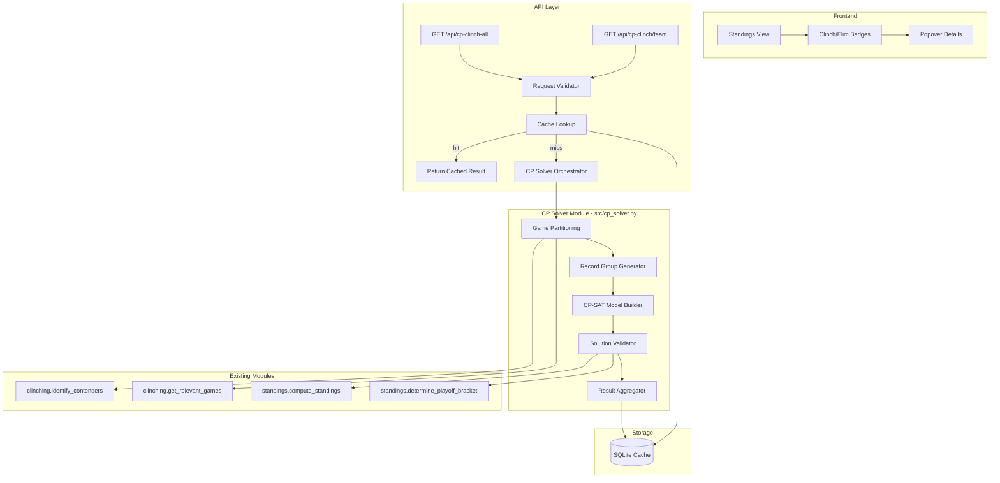
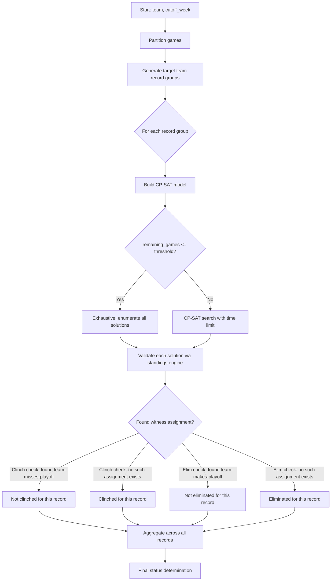

# Design Document: CP Solver for Playoff Clinching/Elimination

## Overview

This feature adds a Constraint Programming (CP) solver that determines whether an NFL team has mathematically clinched or been eliminated from playoff contention. It uses Google OR-Tools CP-SAT to model remaining game outcomes as integer variables and leverages the existing standings/tiebreaker engine to validate each candidate outcome assignment.

**Key Design Decision — Hybrid Approach:** NFL tiebreakers are deeply conditional (head-to-head, common games, strength of victory, etc.) and cannot be directly encoded as linear/integer constraints. The solver uses a **hybrid strategy**:

1. CP-SAT constrains the arithmetic: win/loss/tie counts, record bounds, and simple dominance relationships.
2. For each candidate record assignment that passes CP-SAT filtering, the existing `standings.py` engine (with full tiebreaker logic) determines the actual playoff bracket.
3. This avoids encoding ~11 tiebreaker steps as constraints while still leveraging CP-SAT's propagation to prune impossible record combinations early.

The CP solver coexists with the existing enumeration-based clinching solver (`clinching.py`), reusing its game partitioning functions (`identify_contenders`, `get_relevant_games`) while operating from week 1 onward (no week-14 gate).

## Architecture



### High-Level Flow

1. **API receives request** → validates team, cutoff_week, time_limit parameters
2. **Cache check** → return immediately if cached result exists for (team, cutoff_week, season)
3. **Game partitioning** → reuse `identify_contenders` and `get_relevant_games` from `clinching.py`
4. **Record group generation** → enumerate possible W-L-T records for the target team
5. **CP-SAT model construction** → for each record group, build a model constraining all teams' records
6. **Solution search with validation** → use CP-SAT to find feasible assignments, validate each via `standings.py`
7. **Result aggregation** → determine clinched/eliminated/alive status, compute magic number if applicable
8. **Cache storage** → store result keyed by (team, cutoff_week, season)

## Components and Interfaces

### 1. `src/cp_solver.py` — Core Solver Module

The main module implementing the CP-SAT-based clinching/elimination solver.

```python
"""CP-SAT based clinching/elimination solver.

Uses Google OR-Tools CP-SAT to determine whether an NFL team has
mathematically clinched or been eliminated from playoff contention.
"""

from __future__ import annotations

from dataclasses import dataclass, field
from enum import Enum
from typing import Any


class ClinchStatus(Enum):
    """Clinch/elimination status for a team."""
    CLINCHED = "clinched"
    ELIMINATED = "eliminated"
    ALIVE = "alive"
    INCONCLUSIVE = "inconclusive"


@dataclass
class CPSolverResult:
    """Result from the CP solver for a single team.

    Attributes:
        team: Team name.
        status: Clinch/elimination status.
        clinched: True if team has clinched a playoff spot.
        eliminated: True if team is eliminated from contention.
        exhaustive: True if the solver completed all record groups.
        solve_time_ms: Wall-clock solve time in milliseconds.
        num_variables: Number of CP-SAT variables in the model.
        minimum_seed: Minimum possible seed (1-7) if clinched, None otherwise.
        magic_number: Wins needed to clinch (if alive and derivable), None otherwise.
        error: Error message if solver timed out or failed, None otherwise.
        record_groups_completed: How many record groups were fully processed.
        record_groups_total: Total number of record groups to process.
    """
    team: str
    status: ClinchStatus = ClinchStatus.ALIVE
    clinched: bool = False
    eliminated: bool = False
    exhaustive: bool = True
    solve_time_ms: int = 0
    num_variables: int = 0
    minimum_seed: int | None = None
    magic_number: int | None = None
    error: str | None = None
    record_groups_completed: int = 0
    record_groups_total: int = 0


@dataclass
class CPSolverConfig:
    """Configuration for the CP solver.

    Attributes:
        time_limit: Maximum wall-clock seconds for the solver (1-300).
        enumeration_threshold: Max remaining games for exhaustive search.
    """
    time_limit: int = 30
    enumeration_threshold: int = 13


def solve_clinch(
    team: str,
    all_games: list[Any],
    cutoff_week: int,
    config: CPSolverConfig | None = None,
) -> CPSolverResult:
    """Determine clinch/elimination status for a team.

    Main entry point. Models remaining games as CP-SAT variables,
    uses constraint propagation to prune impossible record combinations,
    and delegates tiebreaker resolution to the standings engine.

    Args:
        team: Team name to analyze.
        all_games: All season games (list of Game objects).
        cutoff_week: Games in weeks <= cutoff are fixed.
        config: Solver configuration (uses defaults if None).

    Returns:
        CPSolverResult with clinch/elimination determination.
    """
    ...


def solve_clinch_all(
    all_games: list[Any],
    cutoff_week: int,
    config: CPSolverConfig | None = None,
) -> dict[str, CPSolverResult]:
    """Determine clinch/elimination status for all 32 teams.

    Processes teams in parallel using available CPU cores. Individual
    team failures do not affect other teams' results.

    Args:
        all_games: All season games.
        cutoff_week: Games in weeks <= cutoff are fixed.
        config: Solver configuration.

    Returns:
        Dict mapping team name to CPSolverResult.
    """
    ...
```

### 2. Internal Solver Components

#### Record Group Generator

```python
def _generate_record_bounds(
    team: str,
    team_games: list[Game],
    fixed_wins: int,
    fixed_losses: int,
    fixed_ties: int,
) -> list[tuple[int, int, int]]:
    """Generate all possible (total_wins, total_losses, total_ties) records.

    Enumerates W-L-T distributions from the team's remaining games.
    With N remaining games, produces (N+1)(N+2)/2 distinct records.

    Returns:
        List of (wins, losses, ties) tuples for the team's final record.
    """
    ...
```

#### CP-SAT Model Builder

```python
def _build_cpsat_model(
    team: str,
    conference: str,
    target_record: tuple[int, int, int],
    all_games: list[Game],
    remaining_games: list[Game],
    fixed_standings: dict[str, tuple[int, int, int]],
    contenders: list[str],
) -> tuple[CpModel, dict[str, IntVar], dict[str, IntVar]]:
    """Build a CP-SAT model for the given target record.

    Variables:
    - One IntVar per remaining game with domain {0, 1, 2}
      (0=home_win, 1=away_win, 2=tie)
    - IntVars for each team's total wins, losses, ties

    Constraints:
    - Win/loss/tie arithmetic: team_wins = fixed_wins + sum(game_outcomes where team wins)
    - Record consistency: W + L + T = total_games for each team
    - Target team record: force target team's record to the specified values
    - Simple dominance bounds: if a team can't reach 7th place by wins alone, prune

    Returns:
        Tuple of (model, game_outcome_vars, team_record_vars).
    """
    ...
```

#### Solution Validator (Callback)

```python
class PlayoffValidator:
    """CP-SAT solution callback that validates playoff brackets.

    For each feasible assignment found by CP-SAT, this callback:
    1. Extracts the game outcomes from variable assignments
    2. Calls compute_standings + determine_playoff_bracket
    3. Checks if the target team is in/out of the bracket
    4. Records the result for the solver's final determination
    """

    def __init__(
        self,
        team: str,
        all_games: list[Game],
        game_vars: dict[str, IntVar],
        search_for_miss: bool,
    ):
        """
        Args:
            team: Target team.
            all_games: All games (for standings computation).
            game_vars: Mapping from game_id to CP-SAT variable.
            search_for_miss: If True, search for assignments where team
                misses playoffs (clinch check). If False, search for
                assignments where team makes playoffs (elimination check).
        """
        ...

    def on_solution(self) -> bool:
        """Called by CP-SAT for each feasible solution.

        Returns True to stop search (found what we need),
        False to continue searching.
        """
        ...
```

### 3. API Integration — Extensions to `src/server.py`

New routes added to `NFLRequestHandler`:

| Method | Path | Description |
|--------|------|-------------|
| GET | `/api/cp-clinch/{team}` | Single team clinch/elimination status |
| GET | `/api/cp-clinch-all` | All 32 teams, grouped by conference |

Both endpoints check for OR-Tools availability and return HTTP 503 if not installed.

### 4. Cache Integration — Extensions to `src/cache.py`

New table for CP solver results:

```sql
CREATE TABLE IF NOT EXISTS cp_solver_cache (
    team TEXT NOT NULL,
    cutoff_week INTEGER NOT NULL,
    season INTEGER NOT NULL,
    result_json TEXT NOT NULL,
    computed_at TEXT NOT NULL,
    PRIMARY KEY (team, cutoff_week, season)
);
```

Cache invalidation triggers on `POST /api/fetch-data` completion (deletes all rows for the active season).

### 5. Frontend Integration

Minimal additions to the existing standings view:
- Badge elements rendered inline with team names
- CSS classes using existing Bootstrap color tokens (`.badge.bg-success`, `.badge.bg-danger`, `.badge.bg-secondary`)
- Click handler showing popover with solve details
- Graceful degradation: if `/api/cp-clinch-all` fails, standings render without badges

## Data Models

### Game Outcome Variable Encoding

Each remaining game is modeled as an integer variable with domain {0, 1, 2}:

| Value | Meaning |
|-------|---------|
| 0 | Home team wins |
| 1 | Away team wins |
| 2 | Tie |

### Team Record Derivation

For each team `T` with `N` remaining games:

```
total_wins(T) = fixed_wins(T) + count(game_var[g] == 0 for g where T is home)
                                + count(game_var[g] == 1 for g where T is away)

total_losses(T) = fixed_losses(T) + count(game_var[g] == 1 for g where T is home)
                                   + count(game_var[g] == 0 for g where T is away)

total_ties(T) = fixed_ties(T) + count(game_var[g] == 2 for g where T participates)
```

Invariant: `total_wins(T) + total_losses(T) + total_ties(T) == 17` for all teams (full 17-game season).

### Solver Search Strategy



### Status Determination Logic

**Clinch check** (is the team guaranteed a playoff spot?):
- For EVERY possible target team record: search for an assignment where team misses playoffs
- If NO such assignment exists across ALL record groups → **clinched**
- If ANY such assignment exists → **not clinched** (alive)

**Elimination check** (is the team's season over?):
- For EVERY possible target team record: search for an assignment where team makes playoffs
- If NO such assignment exists across ALL record groups → **eliminated**
- If ANY such assignment exists → **not eliminated** (alive)

**Combined status derivation:**
- clinched=true, eliminated=false → `CLINCHED`
- clinched=false, eliminated=true → `ELIMINATED`
- clinched=false, eliminated=false → `ALIVE`
- solver timed out before completing → `INCONCLUSIVE`

### Magic Number Calculation

For alive teams, the magic number represents the minimum additional wins (or opponent losses) that guarantees clinching. Derived from the solver results:

1. Sort record groups by wins descending
2. Find the minimum `W` where the clinch check succeeds (team is clinched at `W` wins)
3. Magic number = `W - current_wins`

If the solver timed out before processing enough record groups, magic number is omitted.

### API Response Schema

**Single team (`GET /api/cp-clinch/{team}`):**

```json
{
  "team": "Bills",
  "status": "clinched",
  "clinched": true,
  "eliminated": false,
  "exhaustive": true,
  "solve_time_ms": 1234,
  "num_variables": 48,
  "minimum_seed": 2,
  "magic_number": null,
  "error": null
}
```

**All teams (`GET /api/cp-clinch-all`):**

```json
{
  "cutoff_week": 15,
  "season": 2024,
  "conferences": {
    "AFC": [
      {
        "team": "Bills",
        "status": "clinched",
        "solve_time_ms": 1234,
        "num_variables": 48,
        "minimum_seed": 2
      }
    ],
    "NFC": [...]
  }
}
```

### Dependency Management

OR-Tools is declared as an optional dependency in `pyproject.toml`:

```toml
[project.optional-dependencies]
cp = ["ortools>=9.9"]
dev = [
    "pytest==9.1.1",
    "hypothesis==6.156.6",
    "httpx==0.28.1",
    "ortools>=9.9",
]
```

Runtime import guard in `cp_solver.py`:

```python
try:
    from ortools.sat.python import cp_model
    ORTOOLS_AVAILABLE = True
except ImportError:
    ORTOOLS_AVAILABLE = False
```

## Correctness Properties

*A property is a characteristic or behavior that should hold true across all valid executions of a system — essentially, a formal statement about what the system should do. Properties serve as the bridge between human-readable specifications and machine-verifiable correctness guarantees.*

### Property 1: Win/Loss/Tie Arithmetic Consistency

*For any* assignment of game outcomes produced by the solver, and *for any* team, the team's total wins + losses + ties must equal 17 (the number of games in a full NFL regular season), and wins must equal the sum of fixed wins plus games resolved in that team's favor.

**Validates: Requirements 4.1, 4.2, 4.3, 4.4, 4.5, 4.6**

### Property 2: Outcome Variable Correctness

*For any* game with outcome resolved to a winner, exactly one win is assigned to the winning team and exactly one loss to the losing team. *For any* game resolved as a tie, exactly one tie is assigned to each of the two participating teams.

**Validates: Requirements 4.5, 4.6**

### Property 3: Division Winner Invariant

*For any* valid solution produced by the solver, each of the 8 NFL divisions has exactly one division winner, and that winner's win percentage is greater than or equal to every other team in the same division.

**Validates: Requirements 5.1, 5.2**

### Property 4: Wild Card Selection Invariant

*For any* valid solution produced by the solver, each conference has exactly 3 wild card teams that are not division winners, and each wild card team's win percentage is greater than or equal to every non-playoff non-division-winner team in the same conference.

**Validates: Requirements 6.1, 6.2**

### Property 5: Clinch Correctness (Round-Trip)

*For any* team reported as clinched by the solver, there must exist no assignment of remaining game outcomes where the team finishes outside the top 7 seeds in its conference. Equivalently: if we exhaustively enumerate all possible assignments for a small-enough problem, the team appears in the playoff bracket in every single one.

**Validates: Requirements 1.3, 1.4**

### Property 6: Elimination Correctness (Round-Trip)

*For any* team reported as eliminated by the solver, there must exist no assignment of remaining game outcomes where the team appears in the playoff bracket. Equivalently: if we exhaustively enumerate all possible assignments for a small-enough problem, the team never appears in the playoff bracket.

**Validates: Requirements 2.3, 2.4**

### Property 7: Invalid Input Rejection

*For any* team name not in the set of 32 valid NFL team names, the solver SHALL return an error. *For any* cutoff_week outside the range 1–18, the solver SHALL return an error. *For any* time_limit outside 1–300, the solver SHALL return an error.

**Validates: Requirements 1.5, 3.5, 7.5**

### Property 8: Cache Round-Trip

*For any* successful solver result that is stored in the cache, querying the same (team, cutoff_week, season) key must return an equivalent result without re-running the solver, and the round-trip must complete within 100ms.

**Validates: Requirements 13.1, 13.2**

### Property 9: Cache Invalidation

*For any* cached CP solver result, after a game-data fetch completes for the same season, the cache must no longer contain that result, and the next query must trigger a fresh solver run.

**Validates: Requirements 13.3, 13.4**

### Property 10: Bulk Response Structure

*For any* response from the bulk endpoint, the result must contain exactly 32 team entries grouped into AFC (16 teams) and NFC (16 teams), with teams sorted alphabetically within each conference, and each entry must contain status, num_variables, and solve_time_ms fields.

**Validates: Requirements 9.1, 9.2**

## Error Handling

| Scenario | Behavior |
|----------|----------|
| OR-Tools not installed | API returns HTTP 503 with descriptive error; server starts normally; all other endpoints work |
| Invalid team name | HTTP 400 with list of valid teams |
| cutoff_week out of range (not 1-18) | HTTP 400 with valid range message |
| time_limit out of range (not 1-300) | HTTP 400 with valid range message |
| No game data fetched | HTTP 409 indicating data fetch required |
| Solver times out | Returns `INCONCLUSIVE` status with `exhaustive=false` and error message indicating timeout and progress (e.g., "Timed out after 30s: 5/12 record groups completed") |
| Individual team fails in bulk request | That team gets error status; other teams unaffected |
| Standings engine raises exception | Logged, solution skipped, continues search |
| Cache read/write failure | Logged, solver runs without caching; no user-visible error |

## Testing Strategy

### Unit Tests (pytest)

- **Input validation**: verify all boundary conditions for team names, cutoff_week, time_limit
- **CP model construction**: verify correct number of variables, domains, and constraints for known game configurations
- **Record group generation**: verify all (W, L, T) combinations are produced for small game counts
- **API response schema**: verify all required fields present with correct types
- **Cache operations**: verify store/retrieve/invalidate lifecycle
- **OR-Tools unavailability**: verify graceful degradation (HTTP 503, server still starts)
- **Frontend badge rendering**: verify correct CSS classes and popover content

### Property-Based Tests (hypothesis)

Property-based testing is well-suited for this feature because the core solver logic involves pure functions with clear input/output relationships (game assignments → standings → bracket) and universal invariants that must hold across all valid inputs.

**Library:** `hypothesis` (already in dev dependencies)

**Configuration:**
- Minimum 100 iterations per property test
- Custom strategies for generating valid NFL game lists and outcome assignments
- Each test tagged with design property reference

**Tag format:** `Feature: cp-solver-playoff-clinching, Property {number}: {property_text}`

**Properties to implement:**
1. Arithmetic consistency (W+L+T=17 for all teams in any solution)
2. Outcome variable correctness (win→+1W for winner, +1L for loser)
3. Division winner invariant (exactly 1 per division, best win%)
4. Wild card selection invariant (exactly 3 per conference, non-division-winners)
5. Clinch correctness round-trip (clinched → no counter-example exists)
6. Elimination correctness round-trip (eliminated → no witness exists)
7. Invalid input rejection (bad inputs always produce errors)
8. Cache round-trip (store then retrieve returns equivalent result)
9. Cache invalidation (fetch invalidates, next query re-runs solver)
10. Bulk response structure (32 teams, correct grouping and sorting)

### Integration Tests

- End-to-end API tests with real game data (2024 season, week 16 cutoff — known clinch/elimination outcomes)
- Verify CP solver agrees with existing enumeration-based solver for late-season scenarios
- Timeout behavior with large problems (early-season cutoff)
- Parallel processing in bulk endpoint

### Test Data Strategy

- Use the 2024 NFL season (already cacheable) as reference data
- Construct minimal synthetic game sets for property tests (4-team mini-conferences)
- Use `hypothesis` strategies to generate arbitrary game lists with valid team names and week numbers
