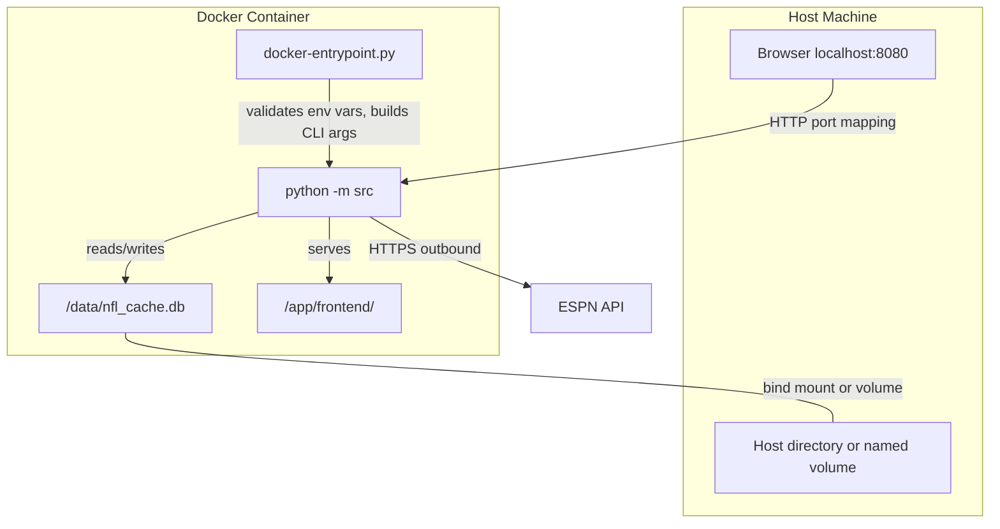
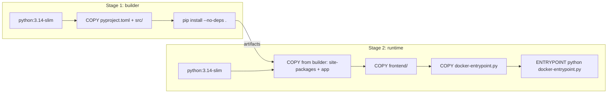

# Design Document: Docker Containerization

## Overview

This design adds optional Docker support to the NFL Monte Carlo Playoff Simulator. The containerization layer wraps the existing Python application without modifying its core logic. A thin entrypoint script bridges Docker's environment-variable-based configuration model with the application's CLI argument interface.

Key design decisions:
- **Multi-stage build**: Keeps the final image minimal (~120 MB) by separating the build/install stage from the runtime stage.
- **Entrypoint script**: A Python script (`docker-entrypoint.py`) reads environment variables, validates them, and constructs the CLI invocation. This keeps the core `server.py` unchanged.
- **Fixed data path**: The container always stores the SQLite database at `/data/nfl_cache.db`, making volume mounting straightforward.
- **`0.0.0.0` binding**: The entrypoint passes `--host 0.0.0.0` implicitly so the server is reachable outside the container. This requires a small addition to the server's argument parser.

## Architecture



### Build Architecture (Multi-Stage)



## Components and Interfaces

### 1. Dockerfile (project root)

Multi-stage build with two stages:

**Stage 1 — builder:**
- Base: `python:3.14-slim`
- Copies `pyproject.toml` and `src/` only
- Runs `pip install .` to install the package and httpx dependency
- Does NOT copy `tests/`, `frontend/`, or dev dependencies

**Stage 2 — runtime:**
- Base: `python:3.14-slim`
- Copies installed packages from builder's site-packages
- Copies `src/` (application source)
- Copies `frontend/` (static assets)
- Copies `docker-entrypoint.py`
- Creates `/data` directory with appropriate permissions
- Sets `WORKDIR /app`
- Sets `EXPOSE 8080`
- Sets `ENTRYPOINT ["python", "docker-entrypoint.py"]`

### 2. docker-entrypoint.py (project root)

A standalone Python script (no third-party dependencies) that:
1. Reads `PORT` and `SEASON` environment variables
2. Validates their values (integer ranges)
3. Exits with code 1 and a descriptive error message on invalid values
4. Constructs the `python -m src` command line, merging env vars with any CMD overrides
5. Applies precedence: CLI args (from CMD) override env vars
6. Always injects `--static-dir /app/frontend` (container path)
7. Execs into the application process (replaces PID 1)

**Interface:**
```python
# Environment variables read:
#   PORT  — optional, integer 1-65535
#   SEASON — optional, integer 2000-2100
#
# Exit codes:
#   0 — normal (application takes over via exec)
#   1 — validation error (invalid PORT or SEASON)
#
# Stdout on error:
#   "Error: PORT environment variable must be an integer between 1 and 65535, got: <value>"
#   "Error: SEASON environment variable must be an integer between 2000 and 2100, got: <value>"
```

### 3. .dockerignore (project root)

Excludes from build context:
```
.venv/
.git/
__pycache__/
.hypothesis/
.pytest_cache/
.playwright-mcp/
nfl_cache.db
tests/
*.pyc
.env
```

### 4. compose.yaml (project root)

```yaml
services:
  simulator:
    build: .
    ports:
      - "${PORT:-8080}:8080"
    environment:
      - PORT=${PORT:-}
      - SEASON=${SEASON:-}
    volumes:
      - nfl-data:/data
    shm_size: "64m"

volumes:
  nfl-data:
```

### 5. Server Modification (src/server.py)

**Network binding**: The existing `NFLSimulatorServer` already binds to `("", port)` — all interfaces. No change needed for container networking.

**Database path**: Currently `Cache.__init__` takes `db_path="nfl_cache.db"` relative to CWD. In the container, the database must live at `/data/nfl_cache.db` for volume mounting to work.

**Change required**: Add a `--db-path` CLI argument to `parse_args()`, defaulting to `"nfl_cache.db"` (preserving existing behavior for non-Docker users). The entrypoint passes `--db-path /data/nfl_cache.db`. The `main()` function passes this value to `Cache(db_path=args.db_path)`.

## Data Models

No new data models are introduced. The existing `Cache` SQLite schema remains unchanged. The containerization is purely an infrastructure concern.

### Configuration Flow

```
Environment Variables          CLI Arguments (CMD override)
     PORT=9090                    --port 9090
     SEASON=2024                  --season 2024
         │                              │
         ▼                              ▼
┌─────────────────────────────────────────────┐
│         docker-entrypoint.py                │
│                                             │
│  1. Read env vars                           │
│  2. Validate ranges                         │
│  3. Parse CMD args                          │
│  4. Apply precedence (CLI > env)            │
│  5. Build final command line                │
│  6. exec("python", "-m", "src", ...)        │
└─────────────────────────────────────────────┘
         │
         ▼
┌─────────────────────────────────────────────┐
│  python -m src --port 9090 --season 2024    │
│               --static-dir /app/frontend    │
│               --db-path /data/nfl_cache.db  │
└─────────────────────────────────────────────┘
```

## Correctness Properties

*A property is a characteristic or behavior that should hold true across all valid executions of a system — essentially, a formal statement about what the system should do. Properties serve as the bridge between human-readable specifications and machine-verifiable correctness guarantees.*

The testable logic in this feature lives in the `docker-entrypoint.py` script — specifically the environment variable parsing, validation, and CLI precedence logic. The Dockerfile, compose.yaml, and documentation are configuration/infrastructure artifacts best verified by smoke tests and integration tests.

### Property 1: Port resolution precedence

*For any* valid port value (integer 1–65535) provided as the `PORT` environment variable and any optional `--port` CLI argument, the entrypoint's resolved port SHALL equal the CLI argument value when present, and the environment variable value otherwise. When neither is provided, the resolved port SHALL be 8080.

**Validates: Requirements 2.2, 2.3, 2.5, 2.9**

### Property 2: Season resolution precedence

*For any* valid season value (integer 2000–2100) provided as the `SEASON` environment variable and any optional `--season` CLI argument, the entrypoint's resolved season SHALL equal the CLI argument value when present, and the environment variable value otherwise.

**Validates: Requirements 2.2, 2.4, 2.6**

### Property 3: Invalid PORT rejection

*For any* string that is not a valid integer representation in the range 1–65535 (including non-numeric strings, negative numbers, zero, numbers > 65535, and floats), when set as the `PORT` environment variable, the entrypoint SHALL exit with a non-zero code and produce an error message containing the invalid value.

**Validates: Requirements 2.7**

### Property 4: Invalid SEASON rejection

*For any* string that is not a valid integer representation in the range 2000–2100 (including non-numeric strings, numbers < 2000, numbers > 2100, and floats), when set as the `SEASON` environment variable, the entrypoint SHALL exit with a non-zero code and produce an error message containing the invalid value.

**Validates: Requirements 2.8**

## Error Handling

| Scenario | Behavior | Exit Code |
|----------|----------|-----------|
| Invalid `PORT` env var | Print error to stderr, exit immediately | 1 |
| Invalid `SEASON` env var | Print error to stderr, exit immediately | 1 |
| `/data` path not writable | SQLite raises `OperationalError`, application logs error and exits | 1 |
| Multiprocessing fork fails | `ProcessPoolExecutor` catches `OSError`, falls back to single-process execution | 0 (continues) |
| ESPN API unreachable | Application handles gracefully (existing behavior), returns HTTP 502 to client | 0 (continues) |
| Docker build fails (e.g., network issues fetching pip packages) | `docker build` exits non-zero, user sees build error | N/A (build-time) |

### Entrypoint Validation Order

1. Validate `PORT` env var (if set). Exit on failure.
2. Validate `SEASON` env var (if set). Exit on failure.
3. Parse CMD arguments for precedence.
4. Exec into application.

This means both env vars are validated before the application starts, providing fast feedback on configuration errors.

## Testing Strategy

### Property-Based Tests (Hypothesis)

The entrypoint's configuration resolution logic is pure and deterministic — given env vars and CLI args, it produces a command line or an error. This makes it ideal for property-based testing.

- **Library**: Hypothesis (already in dev dependencies)
- **Minimum iterations**: 100 per property
- **Target module**: `docker-entrypoint.py` (extracted into a testable `resolve_config()` function)
- **Tag format**: `Feature: docker-containerization, Property N: <text>`

Each of the 4 correctness properties maps to one Hypothesis test:
1. Port precedence — generates valid ports + optional CLI overrides
2. Season precedence — generates valid seasons + optional CLI overrides
3. Invalid PORT rejection — generates invalid port strings
4. Invalid SEASON rejection — generates invalid season strings

### Unit Tests (pytest)

- Default behavior (no env vars, no CLI args → port 8080, current year)
- `.dockerignore` file contains required exclusions
- `compose.yaml` structure validation (named volume, port mapping, env vars)

### Integration Tests (Docker-based, manual or CI)

These require Docker and are marked `@pytest.mark.slow`:
- Image builds successfully under 200 MB
- Container starts and responds to HTTP requests
- Bind mount persists data across container restarts
- Named volume persists data across container restarts
- `docker compose up` starts successfully
- Multiprocessing works with `--shm-size=64m`
- Dev dependencies (pytest, hypothesis) are absent from final image

