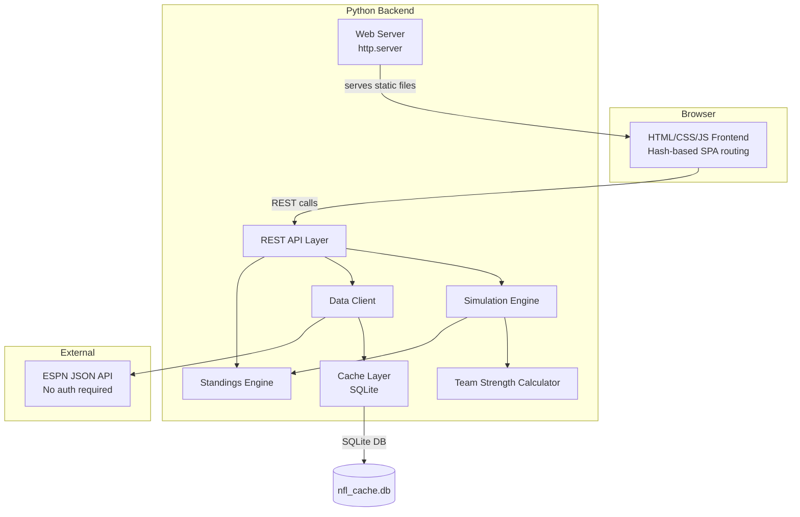
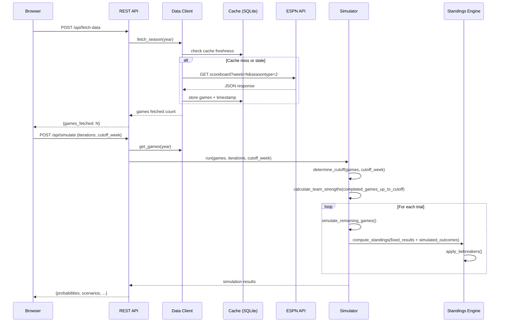

# Design Document: Monte Carlo NFL Playoff Simulator

## Overview

This application is a local Python web application that predicts NFL playoff outcomes using Monte Carlo simulation. The system fetches real NFL game data from ESPN's public JSON API, computes strength-of-schedule-weighted team ratings via iterative convergence, simulates remaining games thousands of times, applies official NFL tiebreaker rules to determine standings in each trial, and presents probability distributions through an interactive browser-based UI.

The architecture follows a layered approach:
- **Data Layer**: ESPN JSON API client with local SQLite caching and TTL policies
- **Computation Layer**: Team strength calculator, Monte Carlo simulator, NFL standings/tiebreaker engine
- **Presentation Layer**: Python HTTP server exposing REST API + static HTML/CSS/JS frontend (no build step)

Key design decisions:
1. **SQLite for caching** — provides atomic writes, query flexibility for game lookups, and zero-config persistence over flat JSON files
2. **Iterative power-rating algorithm** — converges team strengths by repeatedly weighting results by opponent quality until stable (< 0.001 max delta)
3. **Simplified tiebreakers for simulated games** — since simulated games produce only W/L/T outcomes (no point data), point-based tiebreaker steps are skipped for simulated results while real game point data is used when available
4. **No build step frontend** — plain HTML/CSS/JS served directly by the Python HTTP server, hash-based SPA routing
5. **Cutoff week** — allows users to "rewind" the season to any week, simulating all games after the cutoff regardless of actual results; Team_Strength calculation also respects this boundary
6. **ESPN JSON API** — uses ESPN's public, undocumented JSON endpoints (scoreboard, standings, teams) with no authentication required
7. **Configurable tie probability** — each simulated game has a configurable tie probability (default 0.5%), with remaining probability split by Team_Strength
8. **In-progress games** — treated as unplayed in simulation (simulated from scratch); live scores are informational only
9. **Top 50 scenarios** — UI shows the top 50 most likely distinct scenarios to keep results manageable

## Architecture



### Request Flow



## Components and Interfaces

### 1. Data Client (`data_client.py`)

Responsible for fetching NFL data from ESPN's public JSON API endpoints. No authentication required. Extracts points scored by each team for tiebreaker calculations.

```python
from dataclasses import dataclass
from enum import Enum
from datetime import date

class GameStatus(Enum):
    SCHEDULED = "scheduled"
    IN_PROGRESS = "in-progress"
    COMPLETED = "completed"
    POSTPONED = "postponed"
    CANCELLED = "cancelled"

@dataclass(frozen=True)
class Game:
    game_id: str
    week: int
    date: date
    home_team: str
    away_team: str
    status: GameStatus
    home_score: int | None  # None if not completed/in-progress
    away_score: int | None
    home_points: int | None  # Points scored (for tiebreakers)
    away_points: int | None  # Points scored (for tiebreakers)
    quarter: int | None      # For in-progress games
    clock: str | None        # For in-progress games (e.g., "5:32")

@dataclass
class FetchResult:
    games: list[Game]
    warnings: list[str]
    errors: list[str]

class DataClient:
    """Fetches NFL data from ESPN's public JSON API.
    
    ESPN endpoints used:
    - Scoreboard: site.api.espn.com/apis/site/v2/sports/football/nfl/scoreboard
    - Standings: site.api.espn.com/apis/v2/sports/football/nfl/standings
    - Teams: site.api.espn.com/apis/site/v2/sports/football/nfl/teams
    """
    def __init__(self, cache: "Cache", timeout: int = 30) -> None: ...
    def fetch_season_schedule(self, year: int) -> FetchResult: ...
    def fetch_week_results(self, year: int, week: int) -> FetchResult: ...
    def fetch_live_games(self) -> FetchResult: ...
```

### 2. Cache Layer (`cache.py`)

SQLite-based caching with TTL policies per game status.

```python
from datetime import datetime, timedelta

class CachePolicy:
    SCHEDULE_TTL: timedelta = timedelta(hours=24)
    IN_PROGRESS_TTL: timedelta = timedelta(seconds=60)
    COMPLETED_TTL: timedelta | None = None  # Never expires

class Cache:
    def __init__(self, db_path: str = "nfl_cache.db") -> None: ...
    def get_games(self, year: int, week: int | None = None) -> list[Game]: ...
    def get_team_games(self, year: int, team: str) -> list[Game]: ...
    def store_games(self, games: list[Game]) -> None: ...
    def is_fresh(self, year: int, week: int) -> bool: ...
    def get_cache_status(self) -> dict: ...
    def get_last_fetch_time(self) -> datetime | None: ...
```

**TTL Policy Summary:**
| Game Status | TTL | Rationale |
|-------------|-----|-----------|
| Completed | ∞ (never expires) | Final scores don't change |
| In-progress | 60 seconds | Live scores update frequently |
| Scheduled | 24 hours | Schedule rarely changes |

### 3. Team Strength Calculator (`team_strength.py`)

Iterative convergence algorithm for strength-of-schedule-weighted ratings. Respects the Cutoff_Week boundary — only uses completed games from weeks 1 through the cutoff.

```python
@dataclass
class TeamRating:
    team: str
    strength: float
    games_played: int

class TeamStrengthCalculator:
    CONVERGENCE_THRESHOLD: float = 0.001
    MAX_ITERATIONS: int = 100

    def calculate(self, completed_games: list[Game]) -> dict[str, float]:
        """
        Returns mapping of team name -> strength rating.
        Iterates until max change < CONVERGENCE_THRESHOLD or MAX_ITERATIONS reached.
        Only uses completed games. Caller is responsible for filtering by cutoff_week.
        """
        ...

    def _initial_ratings(self, teams: set[str]) -> dict[str, float]: ...
    def _iterate(self, ratings: dict[str, float], games: list[Game]) -> dict[str, float]: ...
    def _max_delta(self, old: dict[str, float], new: dict[str, float]) -> float: ...
```

**Algorithm:**
1. Initialize all teams with rating 1.0
2. For each iteration:
   - For each team, compute new rating = weighted average of game outcomes
   - Win weight = opponent's current rating (beating a strong team is worth more)
   - Loss weight = 1/opponent's current rating (losing to a weak team is more damaging)
   - Tie weight = 0.5 × opponent's rating
3. Normalize ratings so the average is 1.0
4. Check convergence: if max |new_rating - old_rating| < 0.001, stop
5. If 100 iterations reached without convergence, log warning and use final values
6. Teams with no completed games receive the league-wide average strength (1.0)

### 4. Monte Carlo Simulator (`simulator.py`)

```python
from dataclasses import dataclass

@dataclass
class SimulationConfig:
    iterations: int = 10_000
    tie_probability: float = 0.005  # 0.5% default
    cutoff_week: int | None = None  # None = auto-detect latest completed week
    min_iterations: int = 100
    max_iterations: int = 1_000_000

@dataclass
class TeamResult:
    team: str
    conference: str
    division: str
    playoff_probability: float
    seed_probabilities: dict[int, float]  # seed -> probability
    strength_rating: float

@dataclass
class ScenarioResult:
    afc_seeds: tuple[str, ...]  # 7 teams in seed order
    nfc_seeds: tuple[str, ...]
    probability: float

@dataclass
class SimulationResult:
    team_results: list[TeamResult]
    top_scenarios: list[ScenarioResult]  # Top 50 most likely
    iterations_run: int
    cutoff_week_used: int
    low_confidence: bool
    convergence_achieved: bool

class Simulator:
    def __init__(self, config: SimulationConfig) -> None: ...

    def run(self, all_games: list[Game]) -> SimulationResult:
        """
        Partitions games by cutoff_week:
        - Weeks 1..cutoff with status=completed → fixed inputs
        - All other games (including in-progress) → simulated
        Calculates team strengths from fixed games only.
        In-progress games are treated as unplayed — live scores
        are informational only and do not influence simulation.
        """
        ...

    def _determine_cutoff_week(self, games: list[Game]) -> int:
        """Returns latest week where ALL games are completed."""
        ...

    def _simulate_game(
        self,
        home_team: str,
        away_team: str,
        strengths: dict[str, float],
        tie_prob: float,
    ) -> tuple[str | None, str | None]:
        """
        Returns (winner, loser) or (None, None) for tie.
        Tie probability = tie_prob (default 0.5%).
        Remaining probability split proportionally by Team_Strength.
        """
        ...

    def _compute_impact_games(
        self,
        team: str,
        remaining_games: list[Game],
        base_probability: float,
    ) -> list[dict]: ...
```

### 5. Standings Engine (`standings.py`)

Implements NFL standings computation and tiebreaker rules. Point-based tiebreaker steps are skipped for simulated games (which produce only W/L/T outcomes) and used normally for completed (real) games.

```python
from dataclasses import dataclass
from enum import Enum

class Conference(Enum):
    AFC = "AFC"
    NFC = "NFC"

class Division(Enum):
    EAST = "East"
    NORTH = "North"
    SOUTH = "South"
    WEST = "West"

@dataclass
class TeamStanding:
    team: str
    conference: Conference
    division: Division
    wins: int
    losses: int
    ties: int
    win_percentage: float
    division_record: tuple[int, int, int]  # W-L-T
    conference_record: tuple[int, int, int]
    points_for: int | None      # None for simulated-only results
    points_against: int | None
    seed: int | None            # Assigned after tiebreakers
    is_division_champion: bool
    is_playoff_team: bool
    games_behind: float

@dataclass
class PlayoffBracket:
    afc_seeds: list[TeamStanding]  # 7 teams, ordered by seed
    nfc_seeds: list[TeamStanding]

class StandingsEngine:
    NFL_STRUCTURE: dict  # Conference -> Division -> list of team names

    def compute_standings(
        self,
        games: list[Game],
        simulated_outcomes: list[tuple[str, str | None]] | None = None,
    ) -> list[TeamStanding]: ...

    def determine_playoff_bracket(
        self,
        standings: list[TeamStanding],
    ) -> PlayoffBracket: ...

    def _apply_division_tiebreaker(
        self,
        teams: list[TeamStanding],
        all_games: list[Game],
    ) -> list[TeamStanding]: ...

    def _apply_conference_tiebreaker(
        self,
        teams: list[TeamStanding],
        all_games: list[Game],
    ) -> list[TeamStanding]: ...

    def _head_to_head(self, teams: list[TeamStanding], games: list[Game]) -> list[TeamStanding] | None: ...
    def _division_record(self, teams: list[TeamStanding]) -> list[TeamStanding] | None: ...
    def _common_games(self, teams: list[TeamStanding], games: list[Game]) -> list[TeamStanding] | None: ...
    def _conference_record(self, teams: list[TeamStanding]) -> list[TeamStanding] | None: ...
    def _strength_of_victory(self, teams: list[TeamStanding], games: list[Game]) -> list[TeamStanding] | None: ...
    def _strength_of_schedule(self, teams: list[TeamStanding], games: list[Game]) -> list[TeamStanding] | None: ...
```

**Tiebreaker Implementation Notes:**

Division tiebreaker steps (applied in order):
1. Head-to-head record
2. Division record
3. Record in common games
4. Conference record
5. Strength of victory
6. Strength of schedule
7. Combined ranking in conference points scored and points allowed
8. Combined ranking in all-games points scored and points allowed
9. Net points in common games
10. Net points in all games
11. Net touchdowns in all games
12. Coin toss (random selection)

Conference tiebreaker steps (applied in order):
1. Head-to-head record (if applicable — all teams played each other)
2. Conference record
3. Record in common games (minimum 4 common games)
4. Strength of victory
5. Strength of schedule
6. Combined ranking in conference points scored and points allowed
7. Combined ranking in all-games points scored and points allowed
8. Net points in common games
9. Net points in all games
10. Net touchdowns in all games
11. Coin toss (random selection)

**Point-based step handling:** Steps 7-11 (division) and 6-10 (conference) require point data. For simulated games (which produce only W/L/T outcomes), these steps are skipped and the procedure advances to the next applicable step. For completed (real) games, actual points scored data is used normally.

**Multi-team ties:** When 3+ teams are tied, the procedure is applied collectively. If one team is eliminated at any step, the procedure restarts from step 1 for the remaining tied teams.

### 6. Web Server & REST API (`server.py`)

```python
import argparse
from http.server import HTTPServer

class NFLSimulatorServer:
    def __init__(self, port: int = 8080, season_year: int = 2024, static_dir: str = "frontend") -> None: ...
    def start(self) -> None: ...

# REST API Endpoints:
# GET  /api/status              -> cache status, last fetch time
# POST /api/fetch-data          -> trigger ESPN data fetch
# POST /api/simulate            -> run simulation
# GET  /api/standings           -> current standings from cached data
# GET  /api/team/<name>         -> team schedule details
```

**API Request/Response Formats:**

```python
# POST /api/simulate request body
{
    "iterations": 10000,       # optional, default 10000, range [100, 1000000]
    "cutoff_week": 12          # optional, default = latest fully completed week, range [1, 18]
}

# POST /api/simulate response
{
    "team_results": [
        {
            "team": "Kansas City Chiefs",
            "conference": "AFC",
            "division": "West",
            "playoff_probability": 95.3,
            "seed_probabilities": {"1": 42.1, "2": 28.7, "3": 15.2, ...},
            "strength_rating": 1.45
        },
        ...
    ],
    "top_scenarios": [
        {
            "afc_seeds": ["Chiefs", "Bills", "Ravens", "Texans", "Steelers", "Chargers", "Broncos"],
            "nfc_seeds": ["Lions", "Eagles", "49ers", "Buccaneers", "Vikings", "Packers", "Rams"],
            "probability": 0.3
        },
        ...
    ],
    "iterations_run": 10000,
    "cutoff_week_used": 12,
    "low_confidence": false,
    "convergence_achieved": true
}
```

```python
# POST /api/fetch-data response
{
    "games_fetched": 272,
    "warnings": ["Could not fetch week 18: HTTP 404"]
}

# GET /api/standings response
{
    "conferences": {
        "AFC": {
            "East": [
                {"team": "Bills", "wins": 10, "losses": 3, "ties": 0,
                 "win_percentage": 0.769, "games_behind": 0.0},
                ...
            ],
            ...
        },
        "NFC": { ... }
    },
    "last_updated": "2024-12-15T14:30:00Z"
}

# GET /api/team/<name> response
{
    "team": "Bills",
    "record": {"wins": 10, "losses": 3, "ties": 0, "win_percentage": 0.769},
    "games": [
        {"week": 1, "opponent": "Cardinals", "home": true, "status": "completed",
         "home_score": 34, "away_score": 28, "result": "win"},
        {"week": 14, "opponent": "Jets", "home": false, "status": "in-progress",
         "home_score": 14, "away_score": 21, "quarter": 3, "clock": "5:32"},
        {"week": 15, "opponent": "Patriots", "home": true, "status": "scheduled",
         "date": "2024-12-22"},
        ...
    ]
}

# GET /api/status response
{
    "last_fetch_time": "2024-12-15T14:30:00Z",
    "games_cached": 272,
    "season_year": 2024
}

# Error response format (all endpoints)
{
    "error": true,
    "message": "Human-readable error description",
    "code": "ERROR_CODE",
    "details": {}
}
```

Error codes: `ESPN_UNREACHABLE`, `ESPN_SCHEMA_CHANGED`, `INVALID_PARAMETERS`, `NO_CACHED_DATA`, `INTERNAL_ERROR`

### 7. Frontend (`frontend/`)

```
frontend/
├── index.html          # Main page with navigation shell
├── css/
│   └── styles.css      # All styles (responsive 1024px-1920px)
└── js/
    ├── app.js          # Main application logic, hash-based SPA routing
    ├── api.js          # REST API client functions
    ├── standings.js    # Standings view rendering (by conference/division)
    ├── schedule.js     # Team schedule view rendering
    ├── simulation.js   # Simulation controls and results rendering
    └── charts.js       # Chart/heatmap rendering for probabilities
```

**Routing (hash-based SPA):**
- `#standings` — Standings view (default)
- `#team/<name>` — Team schedule view
- `#simulate` — Simulation controls
- `#results` — Simulation results

**Views:**

1. **Standings View** (`#standings`)
   - Displays current NFL standings grouped by conference (AFC/NFC) and division
   - Columns: team name, W, L, T, Win%, Games Behind
   - Sorted by Win% descending within each division; alphabetical for ties
   - Division leader visually distinguished (bold)
   - Clicking a team name navigates to `#team/<name>`
   - Conference filter (AFC/NFC/All)

2. **Team Schedule View** (`#team/<name>`)
   - Header: team name, W-L-T record, Win%
   - All 18 weeks listed chronologically
   - Completed games: week, opponent, home/away, score, W/L/T result
   - In-progress games: opponent, home/away, current score, quarter, clock (informational only)
   - Scheduled games: week, opponent, home/away, date
   - Visual distinction between game statuses (color/icon)
   - Back navigation to standings

3. **Simulation Controls** (`#simulate`)
   - Numeric input: iterations (100–1,000,000, default 10,000)
   - Week selector: dropdown or slider for Cutoff_Week (1–18), default = latest completed week
   - Label showing selected cutoff week and explanation ("Games after week N will be simulated")
   - "Run Simulation" button
   - Progress indicator while simulation runs
   - "Fetch Data" button to trigger ESPN data refresh

4. **Simulation Results** (`#results`)
   - Summary table: each team's playoff probability, grouped by conference, sorted descending
   - Seeding probability matrix: teams × seeds (1-7), grouped by conference
   - Bar chart/heatmap for seeding distribution
   - Top 50 most likely distinct playoff bracket scenarios with probabilities
   - Click team → scenario details with top 5 impact games
   - Team strength ratings displayed alongside probabilities

## Data Models

### SQLite Schema

```sql
CREATE TABLE IF NOT EXISTS games (
    game_id TEXT PRIMARY KEY,
    year INTEGER NOT NULL,
    week INTEGER NOT NULL,
    game_date TEXT NOT NULL,
    home_team TEXT NOT NULL,
    away_team TEXT NOT NULL,
    status TEXT NOT NULL,
    home_score INTEGER,
    away_score INTEGER,
    home_points INTEGER,
    away_points INTEGER,
    quarter INTEGER,
    clock TEXT,
    fetched_at TEXT NOT NULL  -- ISO 8601 UTC timestamp
);

CREATE INDEX idx_games_year_week ON games(year, week);
CREATE INDEX idx_games_home_team ON games(home_team);
CREATE INDEX idx_games_away_team ON games(away_team);
CREATE INDEX idx_games_status ON games(status);

CREATE TABLE IF NOT EXISTS fetch_log (
    id INTEGER PRIMARY KEY AUTOINCREMENT,
    year INTEGER NOT NULL,
    week INTEGER,
    fetched_at TEXT NOT NULL,
    games_count INTEGER NOT NULL,
    success INTEGER NOT NULL DEFAULT 1
);
```

### NFL Team Structure

```python
NFL_TEAMS: dict[str, dict[str, list[str]]] = {
    "AFC": {
        "East": ["Bills", "Dolphins", "Patriots", "Jets"],
        "North": ["Ravens", "Bengals", "Browns", "Steelers"],
        "South": ["Texans", "Colts", "Jaguars", "Titans"],
        "West": ["Chiefs", "Broncos", "Chargers", "Raiders"],
    },
    "NFC": {
        "East": ["Cowboys", "Eagles", "Giants", "Commanders"],
        "North": ["Bears", "Lions", "Packers", "Vikings"],
        "South": ["Falcons", "Panthers", "Saints", "Buccaneers"],
        "West": ["Cardinals", "Rams", "49ers", "Seahawks"],
    },
}
```

### ESPN API Response Mapping

The ESPN scoreboard endpoint (`site.api.espn.com/apis/site/v2/sports/football/nfl/scoreboard`) returns nested JSON. Key extraction paths:

```
Response root
└── events[] (array of games)
    ├── id → game_id
    ├── date → game date (ISO 8601)
    ├── week.number → week number
    ├── status.type.name → game status mapping:
    │   "STATUS_SCHEDULED" → "scheduled"
    │   "STATUS_IN_PROGRESS" → "in-progress"
    │   "STATUS_FINAL" → "completed"
    │   "STATUS_POSTPONED" → "postponed"
    │   "STATUS_CANCELED" → "cancelled"
    ├── status.period → current quarter
    ├── status.displayClock → game clock
    └── competitions[0]
        └── competitors[] (array of 2)
            ├── homeAway → "home" or "away"
            ├── team.displayName → team name
            └── score → points scored (string, used for both score and points data)
```

**Query parameters:**
- `week=N` (1-18) — specific week
- `seasontype=2` — regular season
- `dates=YYYYMMDD-YYYYMMDD` — date range (alternative to week)
- `year=YYYY` or `season=YYYY` — season year

### Cutoff Week Logic

```python
def determine_cutoff_week(games: list[Game], explicit_cutoff: int | None) -> int:
    """
    If explicit_cutoff provided and valid (1-18): use it.
    Otherwise: find the latest week N where ALL games in week N have status=completed.
    """
    if explicit_cutoff is not None:
        if not (1 <= explicit_cutoff <= 18):
            raise ValueError("cutoff_week must be between 1 and 18")
        return explicit_cutoff
    
    for week in range(18, 0, -1):
        week_games = [g for g in games if g.week == week]
        if week_games and all(g.status == GameStatus.COMPLETED for g in week_games):
            return week
    return 0  # No completed weeks
```

**Game partitioning with cutoff:**
- **Fixed inputs**: games in weeks 1..cutoff_week with status "completed"
- **Simulated**: ALL games in weeks > cutoff_week (regardless of actual status) + games in weeks ≤ cutoff_week that are NOT completed (including in-progress games)
- **In-progress games**: always treated as unplayed and simulated from scratch; live scores are informational only and do not influence outcome probabilities
- **Team strength calculation**: uses only fixed input games (completed games in weeks 1..cutoff_week)

### Tie Probability Logic

```python
def simulate_game_outcome(
    home_team: str,
    away_team: str,
    strengths: dict[str, float],
    tie_probability: float = 0.005,
) -> tuple[str | None, str | None]:
    """
    Returns (winner, loser) or (None, None) for tie.
    
    1. Roll for tie: probability = tie_probability (default 0.5%)
    2. If not tie, split remaining probability by strength:
       P(home wins) = (1 - tie_probability) * S_home / (S_home + S_away)
       P(away wins) = (1 - tie_probability) * S_away / (S_home + S_away)
    """
    ...
```

## Correctness Properties

*A property is a characteristic or behavior that should hold true across all valid executions of a system — essentially, a formal statement about what the system should do. Properties serve as the bridge between human-readable specifications and machine-verifiable correctness guarantees.*

### Property 1: ESPN JSON Parsing Round-Trip

*For any* valid ESPN scoreboard JSON response containing games of any status (scheduled, in-progress, completed, postponed, cancelled), parsing the response SHALL produce Game objects where each game's game_id, date, home_team, away_team, status, and scores (when present) exactly match the values in the source JSON.

**Validates: Requirements 1.2, 2.2, 2.5, 3.2**

### Property 2: Schema Error Detection

*For any* JSON object that is missing one or more required fields (id, date, team names, status, score) from the expected ESPN response schema, the parser SHALL raise a schema error that identifies the specific missing field name.

**Validates: Requirements 1.4**

### Property 3: Game Status Filtering

*For any* set of games with mixed statuses, filtering for completed results SHALL return only games with status "completed", and the count of returned games SHALL equal the count of completed games in the input set.

**Validates: Requirements 2.3**

### Property 4: Cache Storage Round-Trip

*For any* list of valid Game objects (including points scored data), storing them in the SQLite cache and then retrieving them SHALL produce an identical list of Game objects (same game_id, week, date, teams, status, scores, points), and each cached entry SHALL have a non-null UTC timestamp recording when it was stored.

**Validates: Requirements 4.1, 4.6**

### Property 5: Cache TTL Freshness by Game Status

*For any* cached game entry with a known status and age, the cache freshness check SHALL return:
- Always fresh (regardless of age) when game status is "completed"
- Stale when game status is "in-progress" and entry age exceeds 60 seconds
- Stale when game status is "scheduled" and entry age exceeds 24 hours
- Fresh otherwise (in-progress < 60s, scheduled < 24h)

**Validates: Requirements 4.2, 4.3, 4.4, 4.5**

### Property 6: Simulation Probability Invariants

*For any* completed simulation with N iterations over 32 NFL teams:
- For each conference, the sum of playoff probabilities across all 16 teams equals 7.0 (7 spots × 100%)
- For each seed position (1-7) within a conference, the sum of all teams' probabilities for that seed equals 1.0
- Each individual team's total seed probability (sum across seeds 1-7) equals its playoff probability
- All probabilities are in the range [0.0, 1.0]

**Validates: Requirements 5.3, 6.2, 6.3**

### Property 7: Completed Games Immutability

*For any* simulation run, the set of completed game outcomes used as fixed inputs SHALL be identical across all trials — no completed game result changes between trials.

**Validates: Requirements 5.4**

### Property 8: Trial Count Validation

*For any* integer value, the simulator SHALL accept it as a valid trial count if and only if it is a positive integer in the range [100, 1,000,000]. All values outside this range or non-integer values SHALL be rejected with a validation error.

**Validates: Requirements 5.5, 5.6**

### Property 9: Game Outcome Probability Proportional to Strength

*For any* two teams with strength ratings S_a and S_b where S_a > 0 and S_b > 0, over a large number of simulated games:
- The tie probability SHALL approximate the configured tie_probability parameter (default 0.5%)
- The ratio of team A wins to team B wins SHALL approximate S_a / S_b
- When S_a equals S_b, each team's win count SHALL approximate 50% of non-tie outcomes

**Validates: Requirements 5.7, 9.6, 9.7**

### Property 10: Cutoff Week Validation

*For any* integer value, the simulator SHALL accept it as a valid cutoff_week if and only if it is a positive integer in the range [1, 18]. All values outside this range or non-integer values SHALL be rejected with a validation error.

**Validates: Requirements 5.9, 5.12**

### Property 11: Cutoff Week Game Partitioning

*For any* set of games across weeks 1-18 and any valid cutoff_week value C:
- All games in weeks 1..C with status "completed" SHALL be treated as fixed inputs
- All games in weeks (C+1)..18 SHALL be treated as unplayed and simulated, regardless of their actual status
- Games in weeks 1..C that are NOT completed (including in-progress games) SHALL also be simulated from scratch
- In-progress games SHALL never use their live scores to influence simulation outcome probabilities
- Team strength calculation SHALL use only the fixed input games (completed games in weeks 1..C)

**Validates: Requirements 5.8, 5.10, 5.13**

### Property 12: Default Cutoff Week Determination

*For any* set of games across weeks 1-18 with various completion statuses, when no explicit cutoff_week is provided, the simulator SHALL default to the latest week number N where ALL games in week N have status "completed". If no such week exists, the cutoff SHALL be 0 (all games simulated).

**Validates: Requirements 5.11**

### Property 13: Distinct Scenarios Uniqueness

*For any* simulation result, all reported scenarios SHALL be distinct — no two scenarios in the output have the same assignment of teams to seeds in both conferences simultaneously.

**Validates: Requirements 6.1**

### Property 14: Impact Games Ordering

*For any* team's scenario details, the reported impact games SHALL be sorted by absolute impact value in descending order, and the list SHALL contain at most 5 entries.

**Validates: Requirements 6.4**

### Property 15: Team Strength Convergence

*For any* set of completed games involving 2 or more teams, the iterative team strength calculation SHALL terminate with either:
- max_delta < 0.001 (convergence achieved), OR
- iteration_count = 100 (max iterations reached)

And all resulting team ratings SHALL be positive real numbers.

**Validates: Requirements 9.4, 9.5**

### Property 16: Team Strength Monotonicity

*For any* team, replacing one of its wins against a weaker opponent (lower strength) with a win against a stronger opponent (higher strength) SHALL result in an equal or higher team strength rating after recalculation. Conversely, replacing a loss against a strong opponent with a loss against a weaker opponent SHALL result in an equal or lower rating.

**Validates: Requirements 9.2, 9.3**

### Property 17: Team Strength Input Filtering

*For any* set of games with mixed statuses and a given cutoff_week C, the team strength calculator SHALL use only games with status "completed" in weeks 1 through C as inputs. Games with status "scheduled", "in-progress", "postponed", or "cancelled", and games in weeks after C, SHALL not influence the calculated ratings.

**Validates: Requirements 9.9, 5.13**

### Property 18: Win Percentage Formula

*For any* team record with wins W, losses L, and ties T where (W + L + T) > 0, the calculated win_percentage SHALL equal (W + 0.5 × T) / (W + L + T), expressed as a decimal between 0.000 and 1.000.

**Validates: Requirements 10.2**

### Property 19: Playoff Bracket Structure

*For any* valid set of 32-team standings (16 per conference, 4 per division), the playoff bracket SHALL contain exactly 7 teams per conference, where exactly 4 are division champions (one per division) seeded 1-4, and exactly 3 are wild card teams seeded 5-7. Division champions SHALL be seeded in descending order of win percentage, with conference tiebreakers applied for ties.

**Validates: Requirements 10.3, 10.7**

### Property 20: Tiebreaker Total Ordering

*For any* set of 2 or more teams with identical win percentages within the same division or conference, the tiebreaker procedure SHALL produce a strict total ordering (no remaining ties except by coin toss) that is deterministic given the same input data.

**Validates: Requirements 10.4, 10.5, 10.6**

### Property 21: Point-Based Tiebreaker Step Handling

*For any* tiebreaker evaluation involving a mix of completed and simulated games:
- Point-based steps (points scored, points allowed, net points, net touchdowns) SHALL use actual point data from completed games when available
- Point-based steps SHALL be skipped (proceeding to the next step) when the games involved are simulated and lack point data

**Validates: Requirements 10.13, 10.14**

### Property 22: Standings Sort Order

*For any* division's team standings, teams SHALL be sorted by win_percentage in descending order. When two or more teams have equal win_percentage, those teams SHALL be sorted alphabetically by team name within the display.

**Validates: Requirements 12.3, 12.4**

## Error Handling

### Data Client Errors

| Error Condition | Behavior | User Impact |
|----------------|----------|-------------|
| ESPN API unreachable (timeout > 30s) | Return error with URL and status code | Error message displayed in UI |
| ESPN API returns non-2xx | Return error with HTTP status code | Error message displayed in UI |
| ESPN response schema changed | Return schema error identifying missing field | Error message with field name |
| Partial week failures | Return successful weeks + warning with failure count | Partial data shown with warning |
| Network error during cache refresh | Return stale cached data + outdated indicator | Data shown with "may be outdated" badge |

### Simulator Errors

| Error Condition | Behavior | User Impact |
|----------------|----------|-------------|
| Invalid trial count (< 100 or > 1M) | Reject with validation error | Input field shows error message |
| Invalid cutoff_week (< 1 or > 18) | Reject with validation error | Selector shows error message |
| No cached data available | Return HTTP 409 Conflict | UI prompts user to fetch data first |
| Team strength non-convergence | Use final iteration + log warning | Results shown with convergence warning |
| Fewer than 100 trials completed | Flag low_confidence in results | "Low confidence" badge on results |

### Web Server Errors

| Error Condition | Behavior | User Impact |
|----------------|----------|-------------|
| Invalid CLI arguments | Print usage help, exit code 1 | Terminal shows help text |
| Port already in use | Print error with port number, exit code 1 | Terminal shows port conflict |
| ESPN API failure during API call | Return HTTP 5xx with JSON error body | UI shows error notification |
| Malformed request body | Return HTTP 400 with validation details | UI shows validation error |

### Error Response Format

All API error responses follow a consistent JSON structure:

```json
{
    "error": true,
    "message": "Human-readable error description",
    "code": "ERROR_CODE",
    "details": {}
}
```

Error codes: `ESPN_UNREACHABLE`, `ESPN_SCHEMA_CHANGED`, `INVALID_PARAMETERS`, `NO_CACHED_DATA`, `INTERNAL_ERROR`

## Testing Strategy

### Property-Based Testing

**Library**: [Hypothesis](https://hypothesis.readthedocs.io/) (Python's standard PBT library)

**Configuration**: Minimum 100 examples per property test (configure via `@settings(max_examples=200)` for critical properties).

**Tag format**: Each property test includes a docstring comment:
```python
# Feature: monte-carlo-playoff-simulator, Property N: <property_text>
```

**Property tests cover:**
- Data parsing correctness (Properties 1-3)
- Cache behavior invariants (Properties 4-5)
- Simulation mathematical invariants (Properties 6-9)
- Cutoff week logic (Properties 10-12)
- Scenario analysis (Properties 13-14)
- Team strength algorithm properties (Properties 15-17)
- Standings computation correctness (Properties 18-22)

### Unit Tests (Example-Based)

Unit tests cover specific scenarios, edge cases, and integration points:

- ESPN API error handling (timeout, HTTP errors, schema changes)
- Cache miss/hit/stale scenarios with specific timestamps
- CLI argument parsing (valid/invalid port, year)
- REST API endpoint contracts (request/response formats)
- Bracket construction rules (2v7, 3v6, 4v5 pairings; bye for #1 seed)
- Low confidence flag when < 100 iterations
- In-progress game handling in simulation (treated as unplayed, live scores ignored)
- Default cutoff week with specific game completion patterns
- Team with no completed games receives average strength
- Partial week fetch failures with warning counts
- Tie probability configuration (non-default values)
- Points data extraction from ESPN JSON for tiebreaker calculations
- Top 50 scenario limit (not unlimited)
- Cache TTL of 60 seconds for in-progress games
- Standings and team schedule API endpoint responses
- Cutoff week selector default value in frontend
- Cutoff week parameter flows through API to simulator
- No games for a team returns appropriate message

### Integration Tests

Integration tests verify component interactions with mocked external dependencies:

- Data Client → Cache → (mocked) ESPN API flow
- REST API → Simulator → Standings Engine pipeline
- Full simulation run with known game data producing expected bracket
- Cutoff week parameter flowing through API → Simulator → Team Strength
- Cache staleness triggering re-fetch from ESPN API
- Standings API endpoint returning computed standings from cached data
- Team schedule API endpoint returning all games for a specific team
- Points data flowing from Data Client through to Standings Engine tiebreakers
- POST /api/simulate with cutoff_week returns cutoff_week_used in response

### Frontend Tests

Since the frontend is plain HTML/JS with no build step, testing is manual or via lightweight browser automation:

- Hash-based navigation between views works
- Data displays correctly after API calls
- Error messages appear on API failures
- Cutoff week selector updates label text dynamically
- Cutoff week selector defaults to latest completed week
- Responsive layout at 1024px and 1920px widths
- Conference filter shows/hides correct teams
- Top 50 scenarios displayed (not unlimited)
- Week selector control (dropdown/slider) for cutoff week
- Team schedule view shows all game statuses correctly
- Standings view shows all 8 divisions with correct columns

### Test File Structure

```
tests/
├── conftest.py                    # Shared fixtures, Hypothesis strategies
├── test_data_client.py            # Properties 1-3, ESPN parsing tests
├── test_cache.py                  # Properties 4-5, TTL tests
├── test_simulator.py              # Properties 6-9, 13-14, simulation tests
├── test_cutoff_week.py            # Properties 10-12, cutoff logic tests
├── test_team_strength.py          # Properties 15-17, convergence tests
├── test_standings.py              # Properties 18-22, tiebreaker tests
├── test_server.py                 # API endpoint integration tests
└── strategies/
    ├── __init__.py
    ├── espn_json.py               # Hypothesis strategies for ESPN JSON responses
    ├── games.py                   # Hypothesis strategies for Game objects
    └── standings.py               # Hypothesis strategies for standings data
```

### Hypothesis Custom Strategies

Key generators needed for property tests:

```python
from hypothesis import strategies as st
from hypothesis import given, settings

# Generate valid Game objects with all statuses
games_strategy = st.builds(
    Game,
    game_id=st.text(min_size=1, max_size=20),
    week=st.integers(min_value=1, max_value=18),
    date=st.dates(),
    home_team=st.sampled_from(ALL_TEAMS),
    away_team=st.sampled_from(ALL_TEAMS),
    status=st.sampled_from(list(GameStatus)),
    home_score=st.one_of(st.none(), st.integers(min_value=0, max_value=70)),
    away_score=st.one_of(st.none(), st.integers(min_value=0, max_value=70)),
    home_points=st.one_of(st.none(), st.integers(min_value=0, max_value=70)),
    away_points=st.one_of(st.none(), st.integers(min_value=0, max_value=70)),
    quarter=st.one_of(st.none(), st.integers(min_value=1, max_value=5)),
    clock=st.one_of(st.none(), st.from_regex(r"[0-9]{1,2}:[0-9]{2}", fullmatch=True)),
)

# Generate valid ESPN JSON responses
espn_event_strategy = st.fixed_dictionaries({
    "id": st.text(min_size=1, max_size=20),
    "date": st.from_regex(r"\d{4}-\d{2}-\d{2}T\d{2}:\d{2}Z", fullmatch=True),
    "status": st.fixed_dictionaries({
        "type": st.fixed_dictionaries({
            "name": st.sampled_from([
                "STATUS_SCHEDULED", "STATUS_IN_PROGRESS",
                "STATUS_FINAL", "STATUS_POSTPONED", "STATUS_CANCELED"
            ])
        }),
        "period": st.integers(min_value=0, max_value=5),
        "displayClock": st.from_regex(r"[0-9]{1,2}:[0-9]{2}", fullmatch=True),
    }),
    "competitions": st.just([{
        "competitors": ...  # Generated per test
    }]),
})

# Generate valid W-L-T records (sum <= 17 games)
records_strategy = st.tuples(
    st.integers(min_value=0, max_value=17),
    st.integers(min_value=0, max_value=17),
    st.integers(min_value=0, max_value=17),
).filter(lambda r: 0 < sum(r) <= 17)

# Generate team strength rating sets
strength_ratings_strategy = st.dictionaries(
    keys=st.sampled_from(ALL_TEAMS),
    values=st.floats(min_value=0.1, max_value=5.0, allow_nan=False, allow_infinity=False),
    min_size=2,
    max_size=32,
)

# Generate game sets with cutoff week scenarios
cutoff_games_strategy = st.lists(
    games_strategy,
    min_size=1,
    max_size=272,  # 16 games/week × 17 weeks (bye weeks reduce actual count)
)

# Generate cutoff week values
cutoff_week_strategy = st.one_of(
    st.none(),
    st.integers(min_value=1, max_value=18),
)
```

### Test Execution

```bash
# Run all tests
pytest tests/ -v

# Run only property tests
pytest tests/ -v -k "property"

# Run with coverage
pytest tests/ --cov=src --cov-report=term-missing

# Run specific property test file
pytest tests/test_cutoff_week.py -v
```

## Future: Internet-Facing Deployment

The application is designed to be deployed on a public web server behind a reverse proxy. Key considerations for this deployment:

### Deployment Architecture

```
Internet → nginx (TLS, auth) → Python backend (localhost:8080)
```

### Requirements

- **Reverse proxy**: nginx handles TLS termination, static file caching, and optional authentication
- **Host binding**: Server must accept `--host 0.0.0.0` or `--host 127.0.0.1` (for proxy-only access)
- **Access control**: HTTP Basic Auth or IP allowlist via nginx to restrict access
- **Static assets**: All served locally (team logos cached, no external CDN dependencies at runtime)
- **Security**: No secrets/paths exposed in responses; error messages are generic for external users
- **Process management**: systemd unit file or similar to keep the server running

### TODO for Deployment

- [ ] Add `--host` CLI argument to bind to specific interfaces
- [ ] Create sample nginx reverse proxy configuration
- [ ] Create systemd service unit file
- [ ] Add HTTP Basic Auth support (or document nginx-level auth)
- [ ] Review error responses for information leakage
- [ ] Add rate limiting considerations for the simulate endpoint
- [ ] Document deployment steps in README

## Future: Parallel Simulation Execution

The Monte Carlo simulation is embarrassingly parallel — each trial is completely independent. This makes it an ideal candidate for multiprocessing.

### Design

```python
from concurrent.futures import ProcessPoolExecutor
import os

def _run_batch(args: tuple) -> dict:
    """Worker function: runs a batch of simulation trials in a separate process.
    
    Args:
        args: Tuple of (games, strengths, batch_size, tie_prob, noise, seed)
    
    Returns:
        Dict with playoff_counts, seed_counts, scenario_counts for merging.
    """
    ...

class Simulator:
    def run(self, all_games: list[Game]) -> SimulationResult:
        num_workers = self.config.num_workers or os.cpu_count() or 1
        
        if num_workers <= 1:
            return self._run_single(all_games)
        
        batch_size = self.config.iterations // num_workers
        remainder = self.config.iterations % num_workers
        
        batches = [
            (fixed_games, remaining_games, strengths, batch_size + (1 if i < remainder else 0), 
             self.config.tie_probability, random_seed_for_worker_i)
            for i in range(num_workers)
        ]
        
        with ProcessPoolExecutor(max_workers=num_workers) as pool:
            results = list(pool.map(_run_batch, batches))
        
        return self._merge_results(results)
```

### Key Considerations

- **Data serialization**: Game data and team strengths are small (~50KB) and serialized once per worker via pickle
- **Random state**: Each worker gets an independent seed derived from the parent's RNG to avoid correlated trials
- **Result merging**: Sum counters (playoff_counts, seed_matrices) across workers; merge scenario dicts by key
- **Overhead**: Process startup cost (~50-100ms) is amortized over thousands of trials per worker
- **Fallback**: Single-core mode avoids ProcessPoolExecutor entirely (no overhead)
- **Error handling**: If any worker raises, the entire simulation reports an error rather than returning partial results

### Expected Speedup

| Cores | Iterations | Approx. Time (vs single-core) |
|-------|-----------|-------------------------------|
| 1     | 10,000    | 1.0x (baseline)               |
| 4     | 10,000    | ~3.5x faster                  |
| 8     | 10,000    | ~6.5x faster                  |
| 16    | 10,000    | ~12x faster                   |

Sub-linear scaling due to process spawn overhead and result merging, but the per-trial work (simulate all remaining games + full standings/tiebreakers) is substantial enough to dwarf the overhead.
