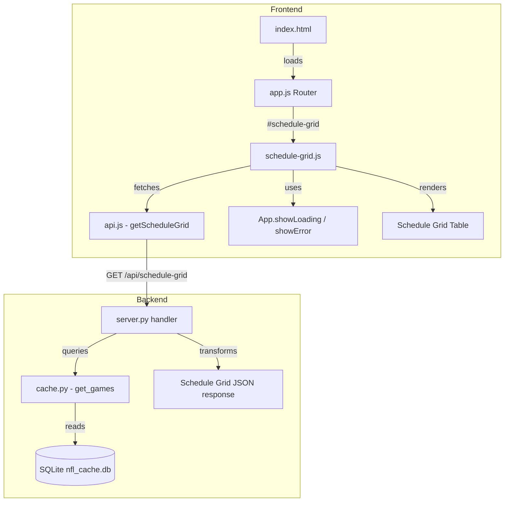

# Design Document: NFL Schedule Grid

## Overview

The NFL Schedule Grid adds a league-wide, at-a-glance schedule view to the NFL Monte Carlo Playoff Simulator. It displays all 32 NFL teams as rows and regular-season weeks 1–18 as columns in a compact table, with each cell showing the opponent abbreviation (prefixed with "@" for away games), "BYE" for bye weeks, and scores for completed or in-progress games. The grid always shows the currently loaded season.

The feature spans both backend (new API endpoint) and frontend (new view module, route registration, navigation link, CSS styles). It integrates with the existing hash-based SPA router, the `API` module, and the SQLite cache layer.

## Architecture



### Request Flow

1. User clicks "Schedule" nav link → hash changes to `#schedule-grid`
2. Router in `app.js` invokes `renderScheduleGrid(contentEl)`
3. `schedule-grid.js` calls `API.getScheduleGrid()` which issues `GET /api/schedule-grid`
4. Backend handler retrieves all games for the current season year from the SQLite cache
5. Backend transforms raw game rows into a structured per-team/per-week grid format
6. Frontend renders the response as an HTML table with team logos, opponent abbreviations, scores, and clickable links

## Components and Interfaces

### Backend Components

#### `_handle_get_schedule_grid` (in `server.py`)

New GET handler registered for path `/api/schedule-grid`.

**Responsibilities:**
- Use the server's configured `season_year`
- Retrieve all games for the current season from `Cache.get_games(season_year)`
- Transform games into the grid response structure (32 team entries × 18 weeks)
- Return 404 for missing data, 200 on success

**Interface:**
```python
def _handle_get_schedule_grid(self) -> None:
    """Handle GET /api/schedule-grid — return league-wide schedule grid data."""
```

#### `_build_schedule_grid` (helper function in `server.py`)

Pure transformation function that converts a list of `Game` objects into the grid JSON structure.

**Interface:**
```python
def _build_schedule_grid(games: list[Game], all_teams: list[str]) -> list[dict[str, Any]]:
    """Build schedule grid data from raw game list.
    
    Args:
        games: All games for a season (from cache).
        all_teams: List of all 32 team names.
    
    Returns:
        List of 32 team entries, each containing:
        - team: full team name (e.g., "Bills")
        - abbreviation: short ID (e.g., "BUF")
        - weeks: list of 18 entries (index 0 = week 1), each null for bye or:
          - opponent: abbreviation of opponent
          - home: boolean (true = home game)
          - status: "scheduled" | "in-progress" | "completed"
          - team_score: int | null
          - opponent_score: int | null
    """
```

### Frontend Components

#### `schedule-grid.js` (new file)

New view module that renders the schedule grid.

**Exported function:**
```javascript
async function renderScheduleGrid(contentEl)
```

**Responsibilities:**
- Fetch schedule grid data via `API.getScheduleGrid()`
- Render the 32-row × 19-column HTML table
- Handle loading states and errors
- Wire team name links to `#team/<team_name>` routes
- Wire score cells as clickable links to team detail pages

#### `API.getScheduleGrid()` (addition to `api.js`)

```javascript
/**
 * Get league-wide schedule grid data for the current season.
 * GET /api/schedule-grid
 *
 * @returns {Promise<{teams: Object[]}>}
 */
function getScheduleGrid() {
    return request('/api/schedule-grid');
}
```

#### Router Integration (modification to `app.js`)

- Add `"schedule-grid"` to `knownRoutes` array
- Add case in `route()` switch to call `renderScheduleGrid(contentEl)`

#### Navigation Link (modification to `index.html`)

- Add `<li class="nav-item"><a class="nav-link" href="#schedule-grid">Schedule</a></li>` after "Standings" and before "Statistics"

### Abbreviation Mapping

The grid API response uses abbreviations consistent with the team logo filenames already present in the project (e.g., `"buf"`, `"kc"`, `"sf"`). The frontend reuses the existing `TEAM_LOGO_IDS` mapping from `standings.js` to resolve team name → logo filename.

A new reverse mapping (abbreviation → uppercase display abbreviation) is needed for cell rendering:

```javascript
const TEAM_ABBREVIATIONS = {
    "Bills": "BUF", "Dolphins": "MIA", "Patriots": "NE", "Jets": "NYJ",
    "Ravens": "BAL", "Bengals": "CIN", "Browns": "CLE", "Steelers": "PIT",
    "Texans": "HOU", "Colts": "IND", "Jaguars": "JAX", "Titans": "TEN",
    "Chiefs": "KC", "Broncos": "DEN", "Chargers": "LAC", "Raiders": "LV",
    "Cowboys": "DAL", "Eagles": "PHI", "Giants": "NYG", "Commanders": "WSH",
    "Bears": "CHI", "Lions": "DET", "Packers": "GB", "Vikings": "MIN",
    "Falcons": "ATL", "Panthers": "CAR", "Saints": "NO", "Buccaneers": "TB",
    "Cardinals": "ARI", "Rams": "LAR", "49ers": "SF", "Seahawks": "SEA",
};
```

## Data Models

### API Response: `GET /api/schedule-grid`

```json
{
  "teams": [
    {
      "team": "Bills",
      "abbreviation": "BUF",
      "weeks": [
        {
          "opponent": "ARI",
          "home": true,
          "status": "completed",
          "team_score": 34,
          "opponent_score": 28
        },
        null,
        {
          "opponent": "MIA",
          "home": false,
          "status": "scheduled",
          "team_score": null,
          "opponent_score": null
        }
      ]
    }
  ]
}
```

**Field descriptions:**

| Field | Type | Description |
|-------|------|-------------|
| `teams` | array | Exactly 32 team entries |
| `teams[].team` | string | Full team name (e.g., "Bills", "49ers") |
| `teams[].abbreviation` | string | Uppercase abbreviation (e.g., "BUF", "SF") |
| `teams[].weeks` | array | Exactly 18 entries (index 0 = week 1) |
| `teams[].weeks[n]` | object \| null | Game matchup or null for bye week |
| `weeks[n].opponent` | string | Opponent's abbreviation |
| `weeks[n].home` | boolean | True if row team is home |
| `weeks[n].status` | string | "scheduled", "in-progress", or "completed" |
| `weeks[n].team_score` | int \| null | Row team's score (null if not yet played) |
| `weeks[n].opponent_score` | int \| null | Opponent's score (null if not yet played) |

### Backend Transformation Logic

The `_build_schedule_grid` function transforms a flat list of `Game` objects (from the cache) into the grid structure:

1. Initialize 32 team entries with empty 18-element `weeks` arrays (all null)
2. For each game:
   - Find the home team entry → set `weeks[game.week - 1]` with opponent abbreviation, `home=true`, status, and scores (from home team's perspective)
   - Find the away team entry → set `weeks[game.week - 1]` with opponent abbreviation, `home=false`, status, and scores (from away team's perspective)
3. Skip games with status "postponed" or "cancelled" (leave as null/bye)
4. Sort team entries alphabetically by abbreviation for consistent ordering

### Team Abbreviation Mapping (Backend)

The backend needs a name-to-abbreviation mapping. This will be added to `nfl_teams.py`:

```python
TEAM_ABBREVIATIONS: dict[str, str] = {
    "Bills": "BUF", "Dolphins": "MIA", "Patriots": "NE", "Jets": "NYJ",
    "Ravens": "BAL", "Bengals": "CIN", "Browns": "CLE", "Steelers": "PIT",
    "Texans": "HOU", "Colts": "IND", "Jaguars": "JAX", "Titans": "TEN",
    "Chiefs": "KC", "Broncos": "DEN", "Chargers": "LAC", "Raiders": "LV",
    "Cowboys": "DAL", "Eagles": "PHI", "Giants": "NYG", "Commanders": "WSH",
    "Bears": "CHI", "Lions": "DET", "Packers": "GB", "Vikings": "MIN",
    "Falcons": "ATL", "Panthers": "CAR", "Saints": "NO", "Buccaneers": "TB",
    "Cardinals": "ARI", "Rams": "LAR", "49ers": "SF", "Seahawks": "SEA",
}
```


## Correctness Properties

*A property is a characteristic or behavior that should hold true across all valid executions of a system—essentially, a formal statement about what the system should do. Properties serve as the bridge between human-readable specifications and machine-verifiable correctness guarantees.*

### Property 1: Grid table structural invariants

*For any* valid schedule grid API response containing 32 team entries each with 18 week slots, the rendered HTML table SHALL have exactly 1 `<thead>` row with 19 `<th>` elements (each with `scope="col"`), and exactly 32 `<tbody>` rows each containing 19 `<td>` elements, with the first cell in each row having `scope="row"`.

**Validates: Requirements 3.1, 3.2, 3.8**

### Property 2: Cell content matches game type (home/away/bye)

*For any* weekly entry in a schedule grid response: if the entry is `null`, the corresponding cell SHALL display "BYE" with the `text-muted` CSS class; if the entry has `home=true`, the cell SHALL display the opponent abbreviation without an "@" prefix; if the entry has `home=false`, the cell SHALL display the opponent abbreviation prefixed with exactly "@".

**Validates: Requirements 3.5, 3.6, 3.7, 6.5**

### Property 3: Alphabetical sort order invariant

*For any* valid schedule grid response with teams in any order, the rendered table rows SHALL be sorted in ascending alphabetical order by team abbreviation (e.g., "ARI" before "ATL" before "BAL" ... before "WSH").

**Validates: Requirements 3.3**

### Property 4: Team column rendering (logo, abbreviation, link)

*For any* team entry in the schedule grid response, the "TEAM" column cell SHALL contain: an `` element with width=28 and height=28 for the team logo, the team's uppercase abbreviation as visible text, and an `<a>` element whose `href` attribute equals `#team/<URI-encoded team_name>`.

**Validates: Requirements 3.4, 4.1, 4.3**

### Property 5: Backend grid transformation structural guarantees

*For any* set of valid `Game` objects for a season (0 to 272 games with weeks 1–18, statuses in {scheduled, in-progress, completed}), the `_build_schedule_grid` function SHALL return exactly 32 team entries, each with exactly 18 week slots; every non-null slot SHALL contain `opponent` (string), `home` (boolean), and `status` (one of "scheduled", "in-progress", "completed"); every slot with status "completed" or "in-progress" where scores exist in the source game SHALL include integer `team_score` and `opponent_score`; every week where a team has no game SHALL be represented as `null`.

**Validates: Requirements 7.1, 7.4, 7.5, 7.6, 7.7**

### Property 6: Score display rules by game status

*For any* non-null weekly entry rendered in the grid: if `status` is "completed" and scores are present, the cell SHALL display the score in format "TeamScore-OpponentScore" and the cell SHALL be a clickable link to `#team/<team_name>`; if `status` is "in-progress" and scores are present, the cell SHALL display the score in format "TeamScore-OpponentScore (r)" and the cell SHALL be a clickable link; if `status` is "scheduled", the cell SHALL display only the opponent abbreviation with no score text and no link.

**Validates: Requirements 8.1, 8.2, 8.3, 8.4**


## Error Handling

### Backend Errors

| Condition | HTTP Code | Response |
|-----------|-----------|----------|
| No schedule data for current season | 404 | `{"error": true, "message": "No schedule data available.", "code": 404}` |
| Internal server error (DB failure, etc.) | 500 | `{"error": true, "message": "Internal server error", "code": 500}` |

The error response format matches the existing `_json_error` helper pattern already used throughout `server.py`.

### Frontend Error Handling

- **Network failure**: Caught by `API.request()` which throws "Network error: unable to reach the server." → displayed via `App.showError()`
- **API error responses**: Server error message extracted from JSON response body; fallback text "Failed to load schedule grid." used if no message present
- **Loading state management**: `App.showLoading()` called before fetch, `App.hideLoading()` called in both success and error paths (finally pattern)

### Edge Cases

- **Postponed/cancelled games**: Treated as bye weeks (null in the grid). These games exist in the cache but don't contribute to the schedule grid.
- **Missing scores on completed games**: Display only opponent abbreviation without score line or link (defensive rendering)
- **Teams with no games in cache**: All 18 weeks shown as null/BYE (fresh database before data fetch)
- **Unicode in team names**: "49ers" URI-encoded as "49ers" (digits are URI-safe; no encoding needed in practice, but `encodeURIComponent` applied uniformly)

## Testing Strategy

### Backend Tests (pytest + hypothesis)

**Property-based tests** (in `tests/test_schedule_grid.py`):
- Property 5: Test `_build_schedule_grid` with randomly generated game lists
  - Generate 0–272 games with random teams, weeks, statuses, and scores
  - Verify structural guarantees (32 entries, 18 weeks each, correct field types)
  - Verify bye weeks are null, scores present for completed/in-progress games
  - Minimum 100 iterations

**Example-based tests**:
- API returns 404 when no cached data exists
- API returns 200 with data for the current season
- Verify correct home/away perspective (team_score is always from the row team's POV)

### Frontend Tests (vitest + fast-check)

**Property-based tests** (in `frontend/tests/schedule-grid.test.js`):
- Property 1: Structural invariants (32 rows, 19 columns, scope attributes)
- Property 2: Cell content rules (home/away/bye rendering)
- Property 3: Alphabetical sort order
- Property 4: Team column rendering (logo + abbreviation + link)
- Property 6: Score display rules by status
- Each test generates random valid schedule grid data and verifies rendered output
- Minimum 100 iterations per property

**Example-based tests**:
- Navigation link presence and position in navbar
- Route registration and view switching
- Loading/error state management
- Error display on API failure
- "49ers" team name link encoding

### Test Configuration

- Backend: `pytest` with `hypothesis` (already in dev dependencies)
  - Tag format: `# Feature: nfl-schedule-grid, Property N: <description>`
- Frontend: `vitest` with `fast-check` (already in dev dependencies)
  - Tag format: `// Feature: nfl-schedule-grid, Property N: <description>`
- Property tests: minimum 100 iterations via `@settings(max_examples=100)` (hypothesis) / `fc.assert(..., { numRuns: 100 })` (fast-check)
