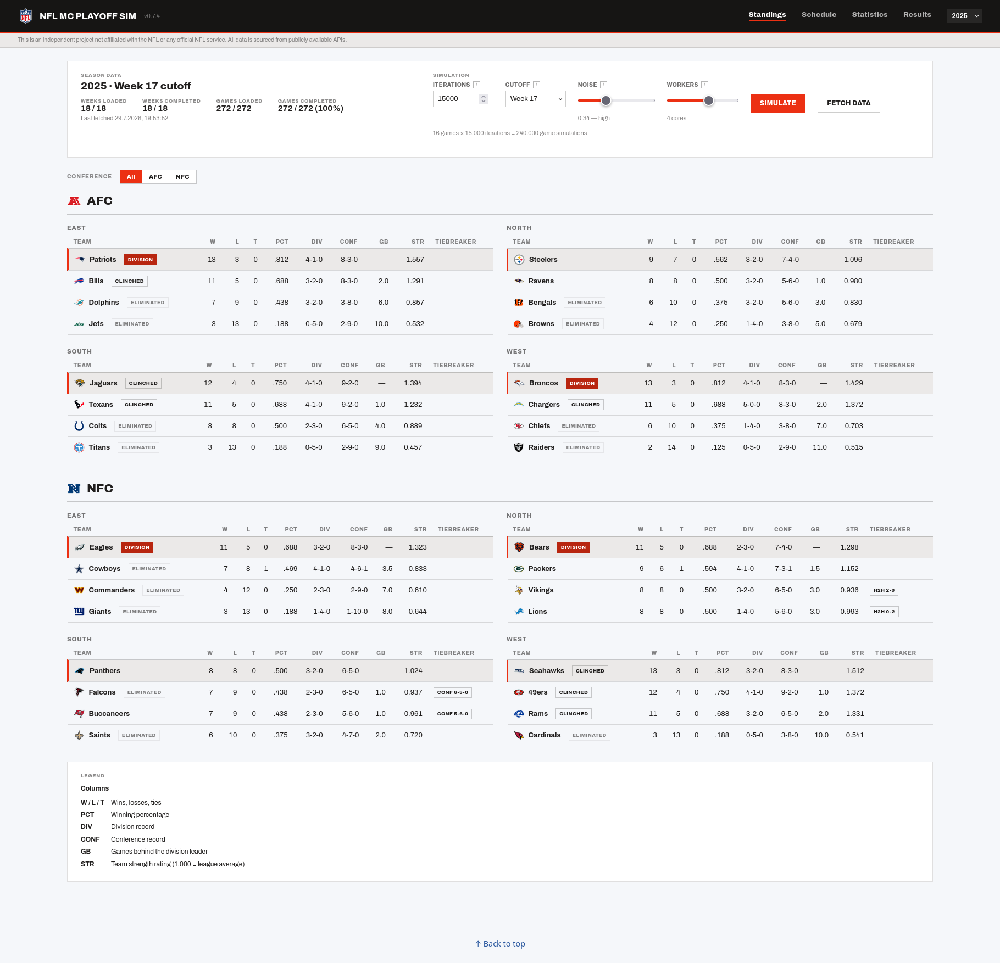
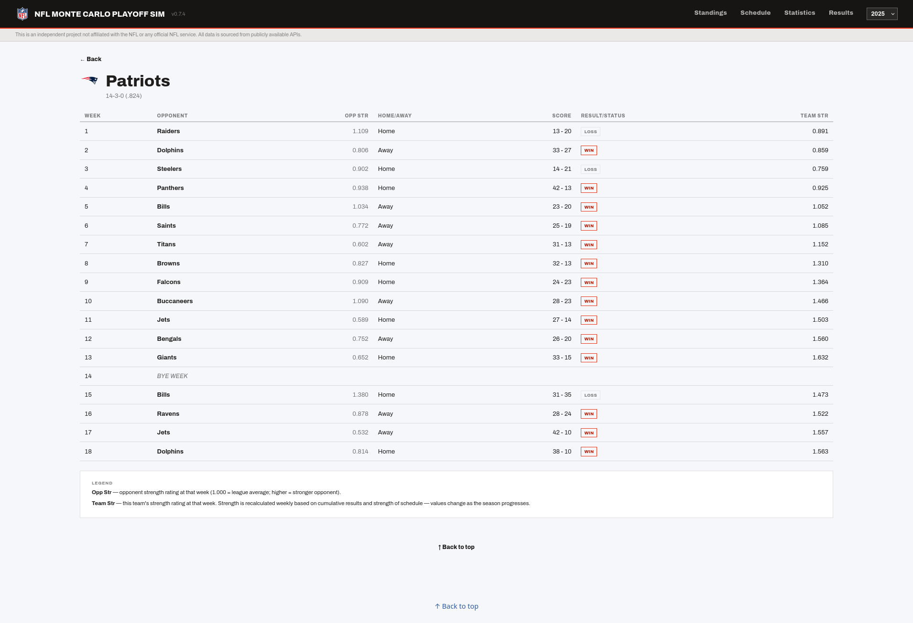
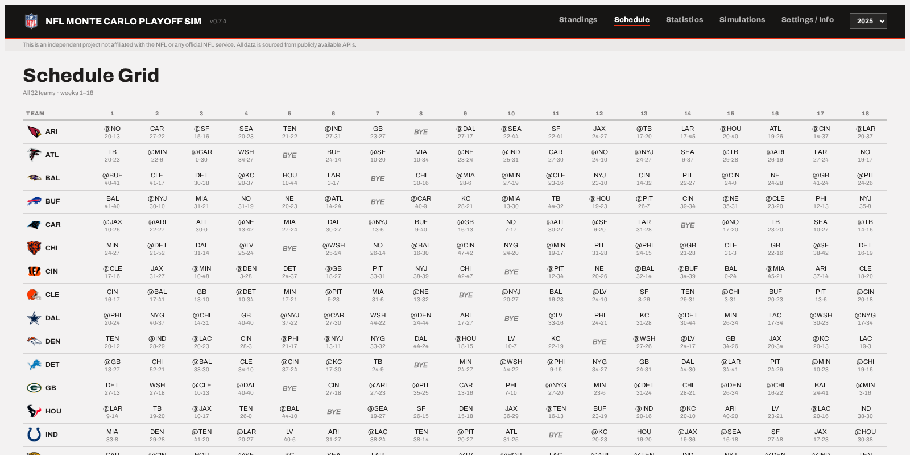
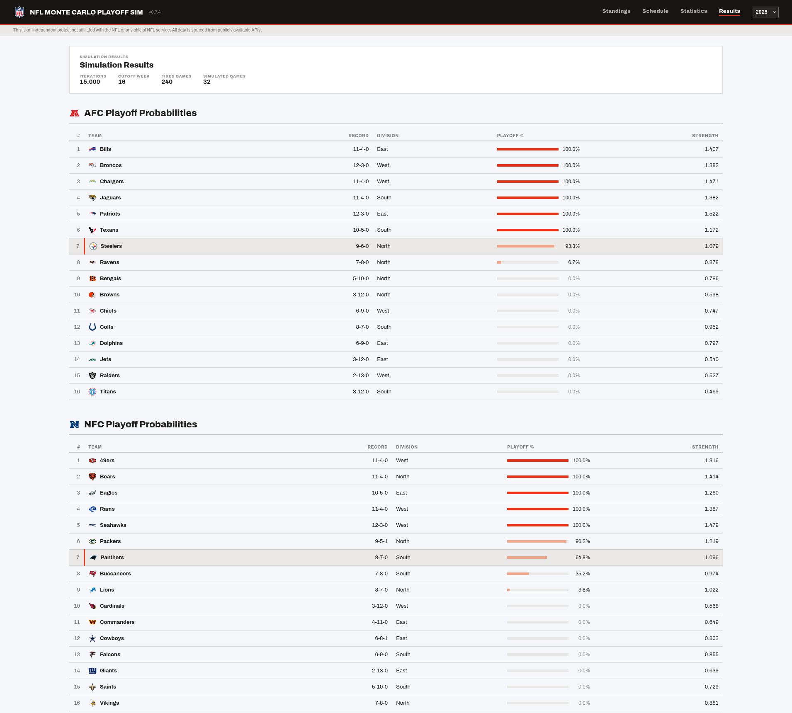
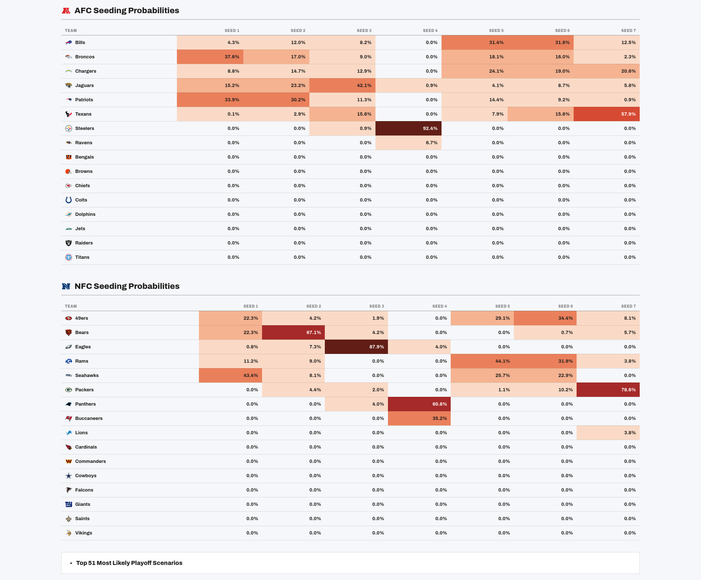
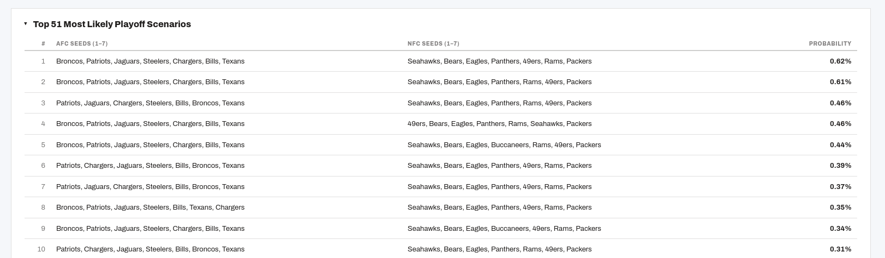
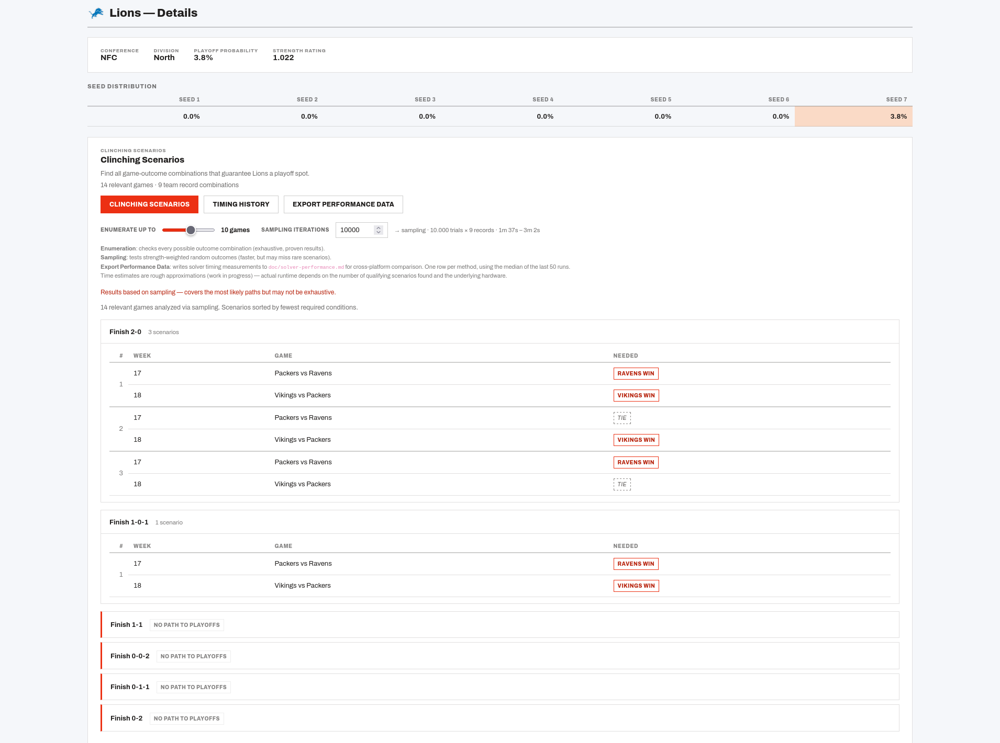
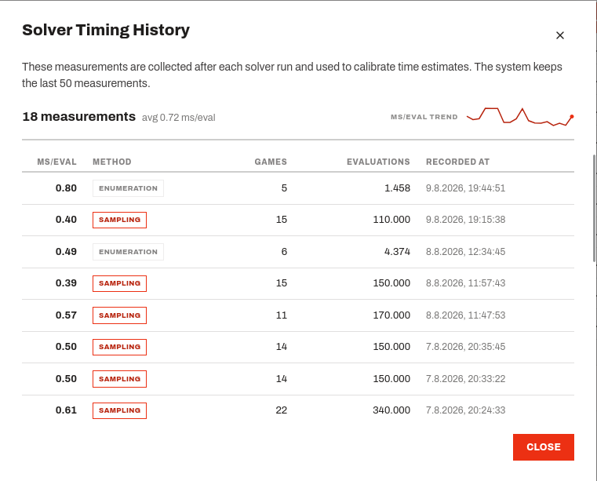
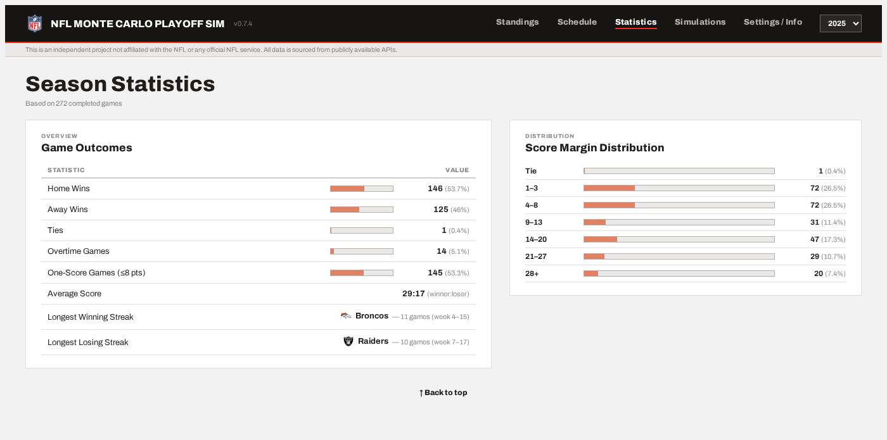
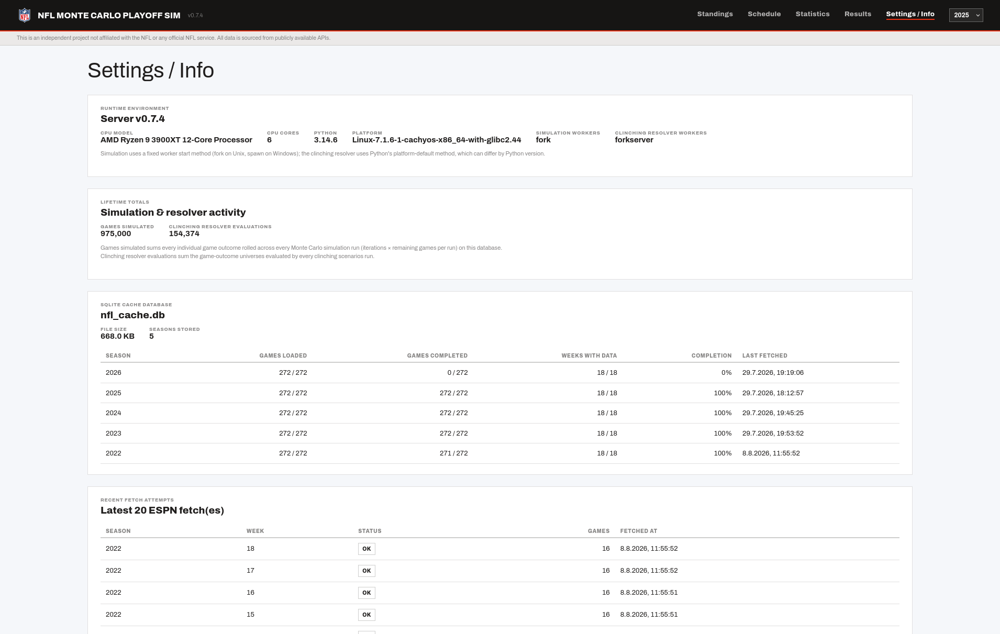

# Screenshots

[← Back to README](../README.md)

Every page in the app, all in the flat, red-on-white "Modernist" design system. See the [README](../README.md#screenshots) for a quick look at the Seeding Probabilities matrix; the full set is below.

## Standings

### Standings page (2025 season, cutoff week 17)

*Standings page in the flat, red-on-white "Modernist Ledger" design. Each team row shows a status tag — DIVISION, #1 SEED, CLINCHED, or ELIMINATED — and, when a standings tie was resolved by a tiebreaker rule, a chip (e.g. "H2H 2-0") that explains why on hover.*

### Team Detail page (2025 season)

*Team Detail page in the same flat "Modernist Ledger" style as Standings, reusing the same ledger table component. Each completed game shows a bordered Win/Loss/Tie tag, and the bye week renders as a single italic row.*

### Schedule Grid (2025 season)

*League-wide Schedule Grid: all 32 teams as rows, weeks 1-18 as columns, with opponent abbreviation, home/away, bye weeks, and scores for completed games — a compact overview of the entire season on one page.*

## Simulations

### Playoff Probabilities (2025 season, cutoff week 16)

*Playoff Probabilities tables for both conferences. Each row shows an inline probability bar, and the 7th seed — the current projected playoff cutoff — is highlighted with the same leader-row treatment used for division leaders in Standings.*

### Seeding Probabilities matrix (2025 season, cutoff week 16)

*Seeding Probabilities matrix: each cell is tinted on a warm tan-to-maroon scale proportional to that team's probability of landing exactly that seed, switching to white text once the tint gets dark enough — never gray, and never tinted at exactly 0%. The collapsed Top Scenarios accordion sits below.*

### Top Playoff Scenarios (2025 season, cutoff week 16)

*The Top Scenarios accordion expanded, ranking the most likely distinct AFC/NFC seeding combinations by probability.*

### Clinching Scenarios (Detroit Lions, 2025 season)

*Inline candidate-details panel (opened by clicking a team on the Simulations page) showing every game-outcome combination that guarantees or eliminates a playoff spot, grouped by remaining record. Conditions for every scenario in a group share one aligned table, with a rowspan'd `#` column tying each scenario's rows together instead of giving every scenario its own separately-sized table.*

### Solver Timing History

*Solver Timing History dialog (opened via the "Timing History" button on the Clinching Scenarios panel): a measurement-count/average stat row with an ms/eval trend sparkline, and a scrollable ledger table where the `sampling` and `enumeration` methods are distinguished by a red-outline vs. dark-outline tag.*

## Statistics

### Season Statistics (2025 season)

*Game Outcomes card (home/away/tie/overtime/one-score win rates as inline percentage bars, average score, longest winning/losing streaks with team logos) alongside a Score Margin Distribution card bucketing every completed game's final margin.*

## Settings / Info

*Settings / Info page: server runtime environment (CPU model/cores, Python version, platform, and the distinct worker start methods used by simulation vs. the clinching resolver), lifetime totals for games simulated and clinching resolver evaluations (with a Reset button), per-season SQLite cache completeness, and the 20 most recent ESPN fetch attempts with failures flagged.*
